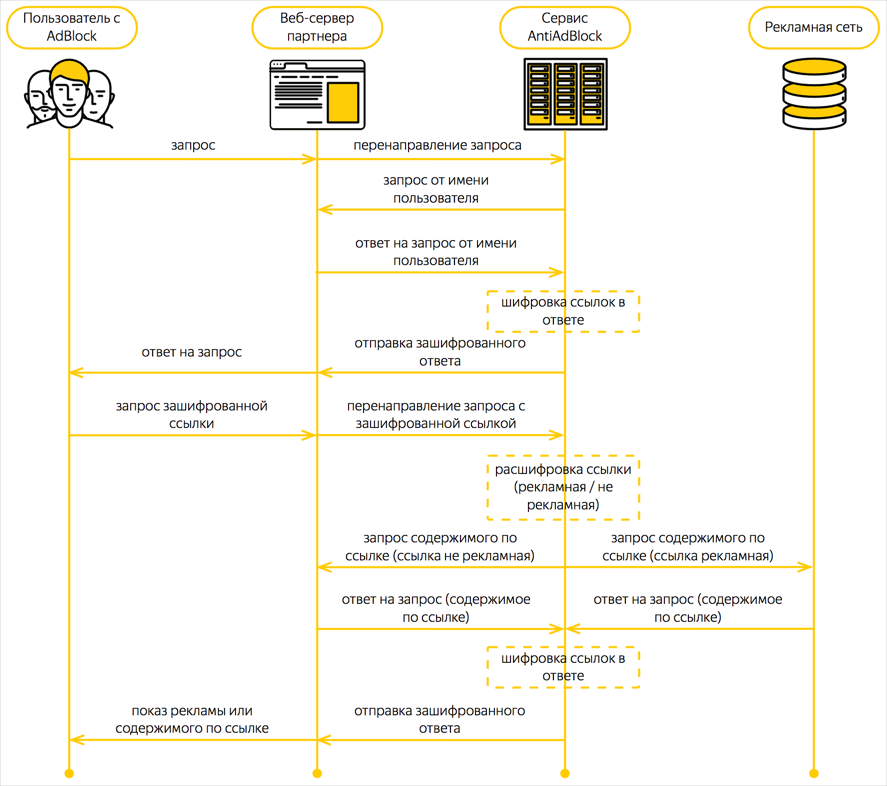

# О сервисе Антиблок

Сервис Антиблок представляет из себя http-сервер и модуль обработки входящих запросов. Через сервис пропускается трафик пользователей с AdBlock-приложением. Перенаправление трафика происходит на уровне веб-сервера/веб-приложения партнера.

* [Механизм работы](#Механизм-работы) <br>
* [Особенности работы](#Особенности-работы) <br>
* [Дополнительные возможности](#Дополнительные-возможности) <br>
* [Пример работы](#Пример-работы) <br>




## Механизм работы

Сервис пропускает через себя весь контент (или часть контента по договоренности) страницы перед выдачей в браузер пользователя (js при проксировании не исполняется).

Для SPA-приложений необходимо проксировать все или часть скриптов, которые формируют верстку. Главное, чтобы код вставки рекламного блока (или скрипт, в котором происходит вставка) проходил через сервис Антиблок.

Во время обработки запроса сервис находит в контенте предварительно заданные шаблоны ссылок и зашифровывает их. Это могут быть не только ссылки на рекламный контент, но и ссылки на контент самой площадки (например, js, css, изображения). Все зашифрованные ссылки приводятся к единому виду и ведут на домен площадки или на другой домен, который принадлежит партнеру.

>##### &#8505; Примечание.<br>
>Необходимые шаблоны сервис задает у себя на сервере в конфигурационном файле партнера. Правки для шаблонов можно вносить с помощью своего менеджера в Яндексе.

После такой процедуры ссылки на рекламный контент становятся неотличимыми от остальных ресурсов страницы. Например, ссылка `an.yandex.ru/some-ads/ad-banner.jpg` для площадки `domain.com` будет зашифрована как `domain.com/40bcYAKy5/u1reoCQ_WVV/J90tH8w7Qgq5hZ27/3uHn9PLoH`.

Также можно шифровать классы и идентификаторы DOM-элементов. Для правильной работы такого механизма необходимо пропустить через сервис Антиблок:
1. CSS-файлы, в которых определены стили для элементов с шифруемыми классами;
2. JS-файлы (при наличии), в которых происходит работа с элементами по шифруемым идентификаторам или классам.

## Особенности работы

1. Сервис принимает и обрабатывает только GET/POST-запросы партнера. Другие запросы не нужно проксировать.

>##### &#9888; Внимание.<br>
>На стороне рекламного кода генерируются служебные рекламные POST-запросы, которые необходимо проксировать. Такие запросы помечены HTTP-заголовком `x-aab-http-check`. Значение заголовка — произвольная величина, необходимо смотреть только на наличие самого заголовка.

2. Не рекомендуется отправлять в сервис ссылки, содержимое которых невозможно зашифровать. Например, картинки, иконки, архивы и бинарные файлы. То есть запрос вида `GET /images/long.png` лучше не передавать в сервис.
Запрос будет обработан, но обработка картинок занимает время и несет определенную нагрузку на сервис и увеличивает время ответа партнеру.

3. Рекомендуется избегать ситуаций, когда содержимое зашифрованной ссылки отдает редирект. Например, в зашифрованной ссылке скрыта обычная `http://domain.com/test`, но при запросе такой ссылки идет редирект на зеркало с `www` — `http://www.domain.com/test`.
>##### &#9888; Ограничение.<br>
>По умолчанию сервис не ходит по редиректам в целях безопасности. Подключение такой функции необходимо согласовать с сервисом.

## Дополнительные возможности

Если остается большой процент пользователей с AdBlock-приложением, у которых реклама продолжает блокироваться после шифрования ссылок, можно использовать дополнительный механизм. Этот механизм ломает верстку сайта путем вырезания определенных классов из html-кода страницы. Далее партнеру рекомендуется выводить сообщение с просьбой отключить AdBlock для восстановления работоспособности сайта.

По умолчанию такой механизм отключен. Чтобы подключить его, сообщите названия классов для вырезания из html-кода, и сервис добавит их в ваш конфигурационный файл у себя на сервере.

>##### &#8505; Примечание.<br>
>Такой способ рекомендуется использовать только крупным площадкам, у которых мало конкурентов и пользователь не уйдет на другой ресурс, а просто отключит AdBlock.

## Пример работы

На странице сайта необходимо зашифровать ссылки. Отрывок исходного HTML-кода:

```html
<script src="/scripts/main/gallery.js"></script>
<script src="https://an.yandex.ru/system/context.js"></script>
<script src="https://yastatic.net/pcode/adfox/loader.js"></script>

<div class="promo">
    
</div>
```

Отрывок HTML-кода после шифрования:
```html
<script src="https://domain.com/jfjd8e/JDhd834/Kdkdoisn/87dhHKJd"></script>
<script src="https://domain.com/40bcYAKy5/u1reoCQ_WVV/J90tH8w7Qgq5hZ27/3uHn9PLoH"></script>
<script src="https://domain.com/dfjIJdjud/55fgddf/KJd98jHF/ffghr4Dfgrr"></script>

<div class="promo">
    
</div>
```

Теперь ссылки самой площадки и рекламные ссылки невозможно различить.

>##### &#8505; Примечание.<br>
>Шифрование происходит с использованием динамического ключа шифрования. Поэтому статическая исходная ссылка может в разное время получать новый зашифрованный адрес.
