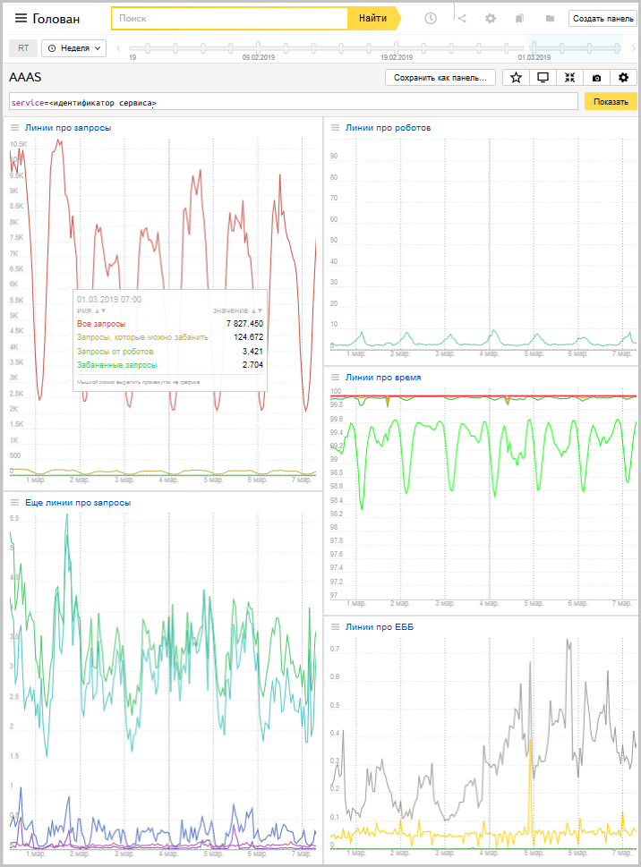

# Графики

Работу Антиробота можно отслеживать с помощью [графиков в Головане](https://yasm.yandex-team.ru/template/panel/aaas/service=). Все графики сервисозависимы (кроме графиков блока **Линии про время**). Для просмотра введите идентификатор сервиса в параметре **service** (идентификатор сервиса определяется при [подключении к Антироботу](workflow.md)).

#### Пример графиков

#### Блоки Линии про запросы и Еще линии про запросы

Графики блоков отражают данные по пользовательским запросам, поступившим от сервиса в Антиробот:
- <q>Все запросы</q> — общее количество запросов, поступивших от сервиса. График отображается после [настройки прохождения трафика](traffic.md).
- <q>Запросы, которые можно банить</q> — запросы, на которые Антиробот потенциально может вернуть капчу в соответствии с [разметкой по типу запросов](markup.md).
- <q>Запросы от роботов</q> — запросы от пользователей, идентификаторы которых найдены в списке роботов внутренней базы Антиробота (см. раздел [Устройство Антиробота](structure.md)). При построении графика не учитывается разметка сервиса по типу запросов.
- <q>Забаненные запросы</q> — запросы, на которые Антиробот вернул капчу.
- Количество загрузок страницы и картинки капчи.
- Количество ошибочного и верного ввода капчи.

#### Блок Линии про роботов

График показывает отношение числа забаненных запросов к тем, на которые Антиробот потенциально может вернуть капчу.

#### Блоки Линии про время

Графики быстродействия Антиробота. За время ответа принимается период обработки запроса Антироботом — с момента поступления запроса в Антиробот до ответа Балансеру. График является сервисонезависимым.

#### Блоки Линии про ЕББ

Графики отражают данные по пользовательским запросам, попавшим под действие [ЕББ](cbb-work.md):
- Количество заблокированных запросов по IP и регулярным выражениям.
- Количество забаненных запросов.
- Количество запросов, которые могут быть забанены в соответствии с условиями мониторинговых флагов.

**Узнайте больше**
- [Golovan. Руководство пользователя](https://doc.yandex-team.ru/Search/golovan-guide/concepts/about.html)