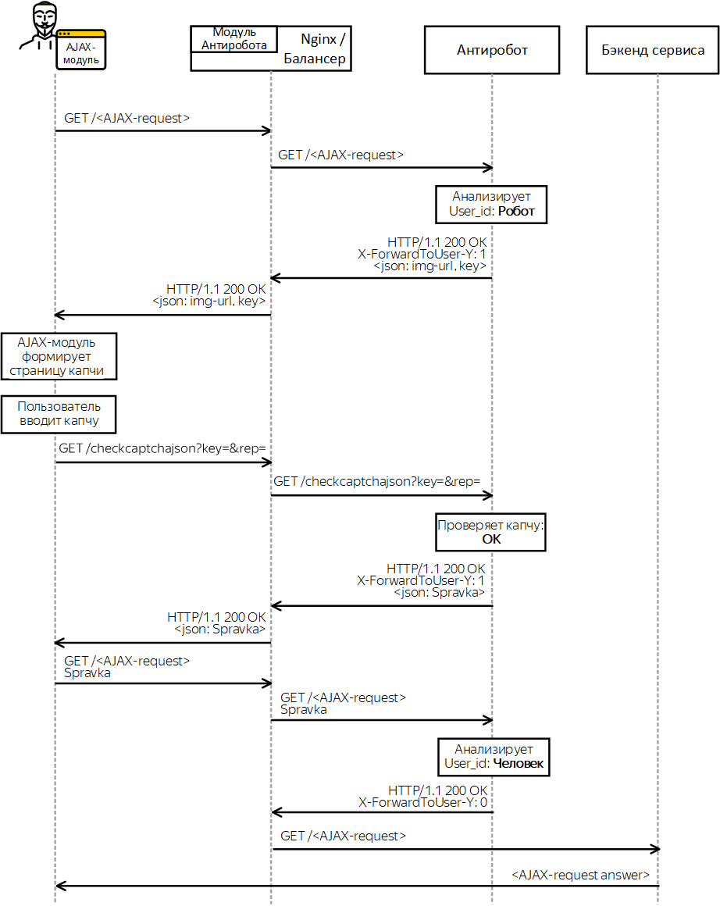

# Прохождение запроса при использовании Антиробота

Схема прохождение пользовательского запроса зависит от типа запроса и от вердикта Антиробота в отношении пользователя, задавшего запрос.

Упрощенные варианты схем представлены ниже:

- [«Человек»](#human)
- [«302 (редирект на капчу)»](#robot)
- [«403 (блокировка)»](#blocking)
- [«Капча для AJAX-запросов»](#ajax)

## Схема «Человек» {#human}

Антиробот вынес решение, что пользователь — человек.

#### Схема


1. Запрос пользователя попадает на балансер.
1. Балансер передает запрос Антироботу.
1. Антиробот проверяет идентификатор пользователя, задавшего запрос (User_id), и выносит решение, что запрос задан человеком. Отвечает балансеру, что запрос следует отправить в бэкенд сервиса (код 200 OK).
1. Балансер передает запрос пользователя в бэкенд сервиса.
1. Сервис возвращает пользователю ответ на запрос.
    
#### Идентификация пользователей {#users}
    
Антиробот анализирует каждый поступивший в него запрос и идентифицирует задавшего его пользователя. Определяя роботность, Антиробот учитывает как параметры самого запроса, так и характеристики предыдущих запросов с такой же идентификацией. Если запрос признан роботным, его идентификатор вносится во внутреннюю базу Антиробота (см. раздел [Устройство Антиробота](structure.md)), и все последующие запросы с этой идентификацией будут забанены.
    
Для идентификации пользователей Антиробот использует куки, а при их отсутствии — IP-адрес.
    
Куки, которые использует Антиробот для идентификации (в порядке убывания приоритета):
    
- spravka — собственная кука Антиробота, выставляется при прохождении капчи ([подробнее](https://doc.yandex-team.ru/Search/antirobot/reference/glossary.html#glossary__spravka-descr));
    
- L, L-кука — выставляется при авторизации в Яндекс.Паспорте;
    
- fuid при условии, что она старше одного дня — уникальный идентификатор Flash-куки пользователя (подробнее см. в [ Вики](https://wiki.yandex-team.ru/JandeksPoisk/IzmerenijaStatistika/FleshKuka/));
    
- i, i-кука при условии, что она старше одного дня — кука идентифицирует браузер пользователя (подробнее см. в [Вики](https://wiki.yandex-team.ru/serp/experiments/icookie2/opisanie/#i-cookie));
    
- собственная подписанная кука сервиса — создается сервисом по аналогии с i-кукой. Наличие такой куки обязательно для сервисов, находящихся вне домена Яндекса.
    
Идентификация пользователя по IP-адресу применяется в крайнем случае, так как одному IP-адресу может соответствовать множество пользователей.

## Схема «302 (редирект на капчу)» {#robot}

Антиробот вынес решение, что пользователь — робот.

#### Схема


1. Запрос пользователя попадает на балансер.
1. Балансер передает запрос Антироботу.
1. Антиробот проверяет идентификатор пользователя, задавшего запрос (User_id), и выносит решение, что запрос задан роботом. Отвечает балансеру редиректом на капчу (код 302 Moved temporarily).
1. Балансер передает пользователю редирект на капчу.
1. Браузер пользователя запрашивает капчу и отображает ее в открытом окне.
1. Пользователь вводит капчу, которая автоматически передается на проверку в Антиробот.
1. Антиробот проверяет корректность введенной капчи:
    - Капча введена верно — выдает пользователю справку и через балансер отправляет в браузер пользователя редирект на исходный запрос. В результате редиректа запрос приходит от пользователя со справкой. Далее запрос проходит [по схеме «Человек»](#human).
    - Капча введена неверно — повторно отправляет пользователю редирект на капчу. Количество повторов не ограничено.

Справка (spravka) — уникальная кука, которую Антиробот выставляет пользователю при прохождении капчи. Справка считается отдельным идентификатором, а пользователь с ней — отдельным пользователем. Справка дает пользователю несколько гарантированных запросов, за которые он не будет забанен, даже если Антиробот признает пользователя роботом.

## Схема «403 (блокировка)» {#blocking}

Антиробот обнаружил, что задавший запрос пользователь попал под эвристики ЕББ.

ЕББ (CBB) — Сервис [cbb.yandex-team.ru](https://cbb.yandex-team.ru), содержащий идентификаторы пользователей, запросы которых необходимо блокировать или банить.

#### Схема


1. Запрос пользователя попадает на балансер.
1. Балансер передает запрос Антироботу.
1. Антиробот проверяет идентификатор пользователя, задавшего запрос (User_id), и обнаруживает его в Единой базе блокировок. Отдает балансеру страницу блокировки (код 403 Forbidden).
1. Балансер возвращает пользователю страницу блокировки.

## Схема «Капча для AJAX-запросов» {#ajax}

Антиробот вынес решение, что AJAX-запрос задал робот.

В зависимости от [настроек сервиса](ajax-request.md) возможны две схемы прохождения запроса:
- [AJAX-запрос с редиректом](#ajax-rdr)
- [AJAX-запрос без редиректа](#ajax-without-rdr)

#### AJAX-запрос с редиректом {#ajax-rdr}

Схема реализована для сервисов, которые предпочитают выполнять редирект на стандартную страницу капчи, а не формировать собственную в интерфейсе пользователя.

#### Схема


1. AJAX-запрос попадает на Балансер.
    
1. Балансер передает запрос Антироботу.
    
1. Антиробот проверяет идентификатор пользователя, задавшего запрос (User_id) и выносит решение, что запрос задан роботом.
    
    Отвечает Балансеру 200 OK и возвращает `json`:
    
    ```
    {
    "type": captcha,
    "captcha": {
    "captcha-page": "<URL для редиректа на страницу капчи>",
    ...
    }
    }
    ```
    
1. Балансер передает AJAX-модулю ответ Антиробота.
    
1. AJAX-модуль выполняет редирект на переданный в `json` URL.
    
    
    
    Если вы хотите, чтобы пользователь после прохождения капчи был перенаправлен на другой URL, передайте новый URL (URL2) в заголовке `X-Retpath-Y` исходного запроса.
    
    
    
1. Антиробот отдает пользователю страницу с капчей.
    
1. Пользователь вводит капчу, которая автоматически передается на проверку в Антиробот.
    
1. Антиробот проверяет корректность введенной капчи:
    
    - Капча введена верно — выставляет пользователю справку и отправляет его на исходный (URL) или новый (URL2) адрес. Так так в новом запросе будет передана выданная справка, запрос пойдет по схеме [«Человек»](#human).
    - Капча введена неверно — пользователю снова показывается капча. Количество повторов не ограничено.
    
#### AJAX-запрос без редиректа {#ajax-without-rdr}

Выполняется, если сервис самостоятельно формирует отображение капчи в интерфейсе пользователя.

#### Схема



1. AJAX-запрос попадает на Балансер.
    
1. Балансер передает запрос Антироботу.
    
1. Антиробот проверяет идентификатор пользователя, задавшего запрос (User_id) и выносит решение, что запрос задан роботом.
    
    Отвечает балансеру 200 OK и возвращает `json`:
    
    ```
    {
    "type": captcha,
    "captcha": {
    "img-url": "<URL картинки для формирования страницы капчи>",
    "key": "<ключ картинки для проверки введенной капчи>",
    ...
    }
    }
    ```
    
    Значения параметров `img-url` и `key` сервис обговаривает с командой Антиробота на этапе подключения.
    
1. Балансер передает AJAX-модулю ответ Антиробота.
    
1. AJAX-модуль формирует отображение капчи в интерфейсе пользователя.
    
1. Пользователь вводит капчу, которая автоматически передается на проверку в Антиробот.
    
1. Антиробот проверяет корректность введенной капчи:
    
    - Капча введена верно — выдает пользователю и через балансер передает ее в AJAX-модуль. AJAX-модуль отправляет новый запрос от пользователя со справкой. Далее запрос проходит по схеме [«Человек»](#human).
    - Капча введена неверно — повторно отправляет AJAX-модулю ответ, содержащий ссылки для формирования капчи. Количество повторов не ограничено.

