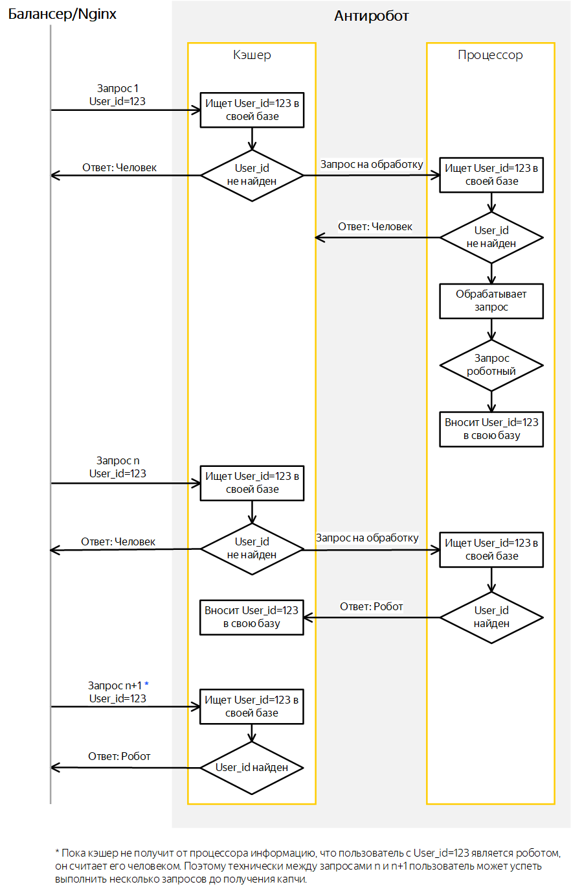

# Устройство Антиробота

Антиробот состоит из двух частей — кэшер и процессор.
#### Кэшер (быстрая составляющая)

Предназначен для оперативного ответа на вопрос, является ли запрос роботным (в 98% случаев время ответа Антиробота составляет менее одной миллисекунды). При получении запроса из балансера кэшер ищет [идентификатор пользователя](users.md), задавшего запрос, в своей базе и сообщает результат на балансер.

Внутренняя база кэшера содержит:

- Список забаненных — список идентификаторов пользователей, которые признаны роботами в результате расчетов процесора. Обновляется при каждом запросе к процессору.
    
- Копию списков ЕББ. Обновляется каждые пять минут.
    
- Копию Белых списков. Обновляется раз в сутки.

ЕББ (CBB) — сервис [cbb.yandex-team.ru](https://cbb.yandex-team.ru), содержащий идентификаторы пользователей, запросы которых необходимо блокировать или банить.
Белые списки (white list) — списки пользователей, по запросам которых Антиробот не возвращает капчу. Хранятся в [Аркадии](https://a.yandex-team.ru/arc/trunk/arcadia/antirobot/scripts/support), не зависят от сервиса и являются едиными для всего Яндекса.
    

#### Процессор (медленная составляющая)

Предназначен для анализа запросов с помощью MatrixNet. Процессор получает запрос из кэшера, рассчитывает для него факторы и формулы и определяет роботность запроса. Порог, после которого запрос считается роботным, настраивается индивидуально для каждого сервиса. Процессор передает результаты расчета в кэшер, а также сохраняет их в собственной базе.

## Порядок взаимодействия кэшера и процессора

#### Блок-схема процесса

Получив запрос пользователя, балансер передает его в кэшер.

1. Используя внутреннюю базу данных, кэшер проверяет, находится ли пользователь с данным идентификатором (User_id) в ЕББ или Белых списках. Если пользователь обнаружен, то кэшер возвращает балансеру информацию, что пользователя необходимо заблокировать (найден в ЕББ) или отправить запрос в бэкенд сервиса без дальнейших проверок (найден в Белом списке).
    
1. Если пользователя нет в ЕББ или Белых списках, кэшер проверяет наличие пользователя с данным идентификатором в списке забаненных.
    
    #### Идентификатор не обнаружен.
    
    - Отправляет балансеру ответ, что данный пользователь — человек.
    - Передает запрос процессору для дальнейшей обработки.
    
    #### Идентификатор обнаружен.
    Отправляет балансеру ответ, что данный пользователь — робот.
    
1. Процессор ищет идентификатор пользователя в своей базе роботов:
    
    #### Идентификатор не обнаружен.
    
    - Отправляет кэшеру ответ, что данный пользователь — человек.
    - Начинает рассчитывать факторы и формулы по запросу. Если в результате расчетов пользователь оценен как робот, сохраняет информацию в своей внутренней базе.
    
    #### Идентификатор обнаружен.
    Отправляет кэшеру ответ, что данный пользователь — робот.
    
1. Получив информацию от процессора, что идентификатор принадлежит роботу, кэшер записывает его в список забаненных. В дальнейшем, при поступлении нового запроса пользователя с данным идентификатором, кэшер находит его в своем списке и сразу возвращает ответ балансеру.
    

Такая схема работы Антиробота позволяет быстро отвечать балансеру о роботности запросов, но при этом первые два запроса всегда проходят в бэкенд сервиса. Если поступят новые запросы с данным идентификатором до того, как процессор завершит расчеты и передаст информацию в кэшер, они также будут расценены как заданные человеком и переданы в бэкенд сервиса.

