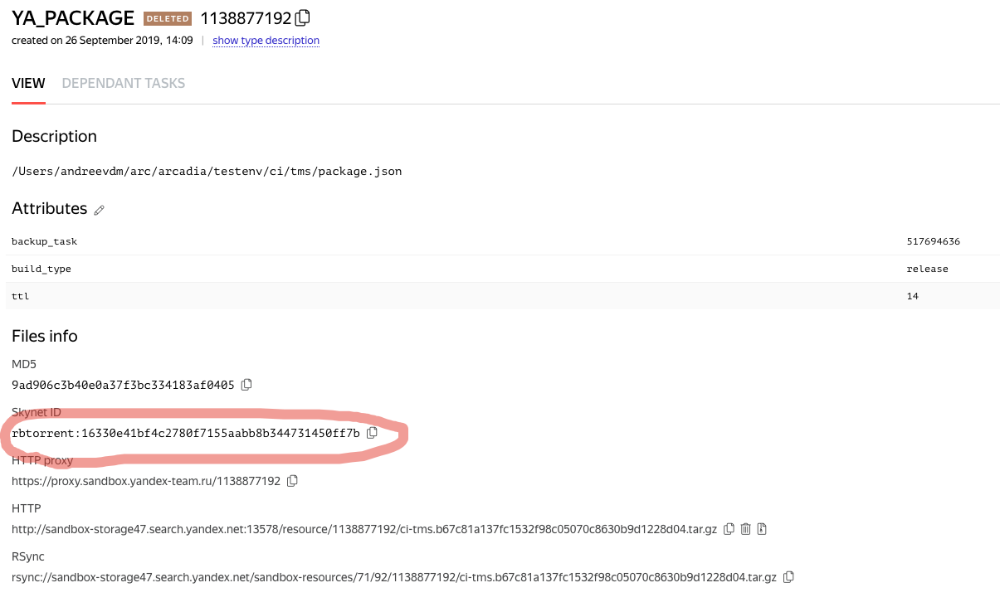
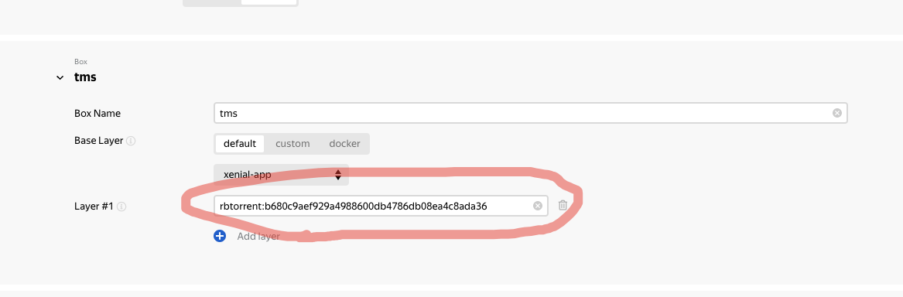

Деплой
===
Приложение живет в Yandex Deploy.
Тестинг - https://deploy.yandex-team.ru/project/ci-tms-testing
Прод - https://deploy.yandex-team.ru/project/ci-tms-stable

1. Собрать пакет с приложением.
`ya package --target-platform=linux --upload --upload-resource-attr=ttl=inf package.json`
В результате будет ссылка на SB ресурс вида https://sandbox.yandex-team.ru/resource/1138877192/view

2. В интерфейсе sandbox получить ссылку на rbtorrent

3. В интерфейсе дейлоя нажать Edit и в Box tms в поле Layer #1 указать новый rbtorrent и сохранить новую конфигурацию

