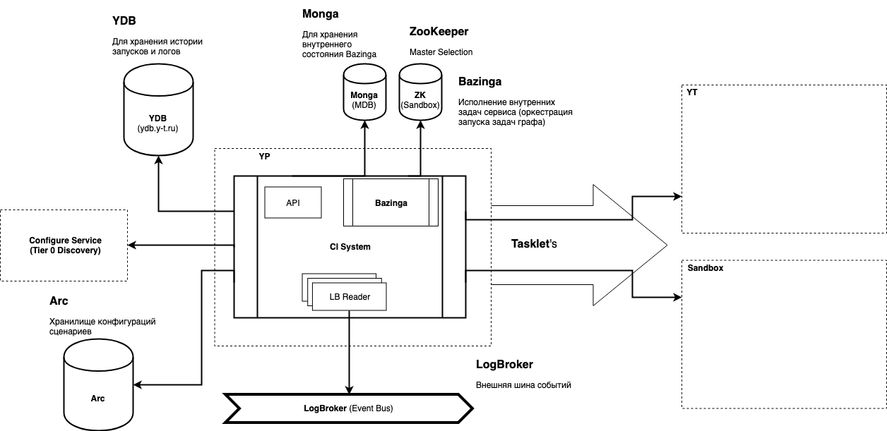

# Архитектура

[Drawio](https://drawio.yandex-team.ru/?lightbox=1&highlight=0000ff&edit=_blank&layers=1&nav=1#R7Vxbc6M2FP41niYP8SCJ66OJk3anyUymyUy7%2B4Zt2aZLkAs4sffXV4CEJSRibHDizO4%2BsOLoApybzvmO4gG6ft78ngSr5T2Z4WgAjdlmgMYDCKHrOfS%2FnLItKQA4ZklZJOGM0XaEx%2FAHZkSDUdfhDKfSwIyQKAtXMnFK4hhPM4kWJAl5lYfNSSQ%2FdRUssEJ4nAaRSv07nGXLkupCZ0f%2FA4eLJX8ysL2yZxJMvy8Sso7Z8wYQzYt%2FZfdzwNdiH5ougxl5FUjoZoCuE0KysvW8ucZRzlzOtnLebUNv9d4JjrM2E0xUzngJojXmr1y8WLblzKDvuMqb8whvRjlzB8jH8Yw1x9MoSNNwSonL7DmiBECb8zCKrklEkmIJzgPkp1lCvlc8LUaSOGMKAOxyZd5teeU960bm0HYo5ZXPBpRdvvrFjAl4VpNxluAgG6WPYbzgn7ZjOdVlTJ5xlmzpyNedzC0mqKUgbk5LcBRk4Yv8lICp3qJarnrCAwnpO0KD2YnNtZ1ZCXIceYmUrJMpZrNEIdYWct09C2VBssCZshBtCJ%2B9IxU60qAvpkZf7Igyxp%2FQxiJvPAXp9whnnE6XrLp%2BSxXtyvAmk3UnwWn4I5gUAwx6v8rfu%2FgSyx9YY0oJonAR56pHZY6pivkvOMlCar4j1vEczmb5fD8KJjjyK6PUqWRdAVWFqoyEPgVvdA6IvW2zRrFZV8bQlEQFu2kSH0Lm8xR3lS3cL9qvY18n1mpcwikX29lkuL3Khsn6Uu1tdDHTbRTGs0Kkr8sww4%2BrYJrTX%2Bk%2BIyvJJBcnnt1NOEH2LG96BkWOjfICNRMF3G8LHsJzVQ8BkNEsQ0lEb8hD55pr8rgn8SLQ8VeV0cX92L%2F8NIw3%2BZQ3GG9rXLPbA99buLhvf7Y0g8cgnk3I5jPbgGXst4FTicJuFMUSSNyz%2F1vnIVPhzK%2FSwpuP6ABgrza7zrqc8sHHr%2FKNkD8xXuFEUIVyRcUI85eViauj3wXq3uU%2BSPONEBqPOKLbUUji%2FS%2B1atREdUsuFYvvnjGJcS3GY6SU6ioNr%2FLYbXf3RKjejq%2Bg0aDRhOriPCpiySXdt3GcxwClarMIoA8trnly21KUuHLaulivixZ7%2Bx3KHVn4OYsTvV8xLm5ecKEg%2Fjpt9uJUCXKGUp0M6UvmLqQgPezu97mUebjBPN5WPYrZjyyghYaWJA3LdYeqQJAu%2BDZ7EAhodvFd%2FIq0G7%2BH2Q%2BodXhmfvVpGwzcWzq0aFjF1Si6yuu4uFpC2xWm0FvIuygRFVcoLCJOFJdCxfWGPxewW9YuF6kot9qn%2B8GPUGbcL49VaL8r2Yipbrtaj9XHvguskxiInD58LvNwG3S66i2ubLAjrHwrWFRpHiM%2BvbC6an3W8IVeJI%2F8ZSCigbievIdo7MPU2Ifdh304GvuosTxHHFbtP7MJSzgEt6oAWFvijM51II7kiKzpx3cY%2B3kj68KemETFDGdBuixmA70mOQ08bsZlTGdomi50LNeGhu16tsowD8hDTsU%2BoGFfHYZ50IeJvRl9e4BNJ7u9lt5ePoIAGkQkCQAOTUP8B7vLQ2fpNXFcf8kzry0NtZ9byYWH66uETHGaHmoBDXn94UoP5ZQIearSQw24Rbfb7my1WqCNamDYI0%2F74CBAchrDgWIpRNP4WdvpgYG6rLLlFtT0oT3uQY5dS%2FGA42hSPAA0fpTrRif2qBHsXZ5I%2F4WDHFvrtCGpHK2EcZBHA4Y5tBxgQpdfVV5wo%2BzECxVGOw9ecF0ZSkzgisyRGp3avBfnVO9%2FVpwD5lDgAeD%2Bh5ucxh29E%2BNsNQgcPXzpm2GHe2yoIE%2BmRr1cHe5kducKcBUO5FXqR3ZLkmxJFiQOopsdtRZNCfzAmzD7JycPocVuv7JRlEPJtuyz%2BO1XNu1fnGVbBvEF64zk6Vr14DtSZHYHFhPKQrUUL5UlZ6ZQJalWkFdldFgVdJQkwVYYwMrEu5VrVXLTkktK0PFqsitXPLZ8yneyvoXrnLdwzbMQroWMkwq3Oq%2FTr3BFyTIrPivhwr6F29ZTwuYsuAsAqWYUb4GQOXzoCrjdrYDG%2Bc2oYUE5ElR3GTypwRFN3qYDnIGEt4twJpTRymIKNC4UxHIkzATKm5Wr2zogtA22abT7gBLhrD2UDbv8aXFNy3HruRNS8SigC1L6AKA0eWQXV9fgz4xO%2Fmy3O4qbY0OQqHo6S%2BPqvA9zdc3nfLq4Ol1FeZ%2Bzg4InKj2DK%2FivW7mGwkseuynGoF4FpNfSt%2FhC3aSc4v209m0bShKCtEmuLjkz3R40Tlf%2BbgkdNXxsj8iRVz9vpCns0EEqa6rKQyfe6CqfXbLWg6sXlXQOwpJOyJHmQ1i7gsTTpy5IHMdyXfEd9sHwDsju%2B5sn8nRHd06njkhFlt7bQI8Ce0%2FIkRYVQ3YO9XNb6eHwqAqA6k4E9GG0qN%2BomcW3vK0FCKRwuoSJPgAhYLb%2FwfiPW8N%2FkAlE6e0fb7g1aXfDi1CLTXOUTNudIlc061yPisNaWAvUyO10fy3RXKjvkkbJQtqTQI2azpW5AmZUwimejBOJR8LGAgziCiCJCpXYcj5lCGCOrQBMhnJczVLOlf0kiRgv15uOop%2FAsVQFtVEP%2Bnma2o%2B0QTjSBlHBL2Xnx%2BwP3BF%2B8P4AbflInMlCg6b9oYoJjhxvMTXqbT8565zgypYdP4Iaw9LhlaCPo0Tmh2cE6KiM4IQcaZERXJN4Hi7WCR7kfzWUvISUGerfrz2FxZ8V5cjeOEynuVveXn7qLOIAWXE8vt0mAYweohjzHdII5600An7QNmGcxTZRTwv2uX1lvAVq0u7m9k3rJEHDm2cKHKVOk1JJZerPPRTk2zDiyx%2BnNbrfgGilRUinRk7fatTacO2TSEoyXKsuCx5hC4LoVldTf4yjOZY81tT55tSzqSu2CeopfstfxegaWvLnNPkMAKy3xh%2FqM%2Bjt7udiyuG7H%2BVBN%2F8D)

## Взаимодействие с пользователями
- Конфиги
- Такслеты
- UI
- API (TODO проработать необходимость и сценарии)

## Основные компоненты

### Тасклеты
[https://clubs.at.yandex-team.ru/arcadia/19906](https://clubs.at.yandex-team.ru/arcadia/19906)
Способ написания задач без привязки к языку программирования

Запуск всех задач CI системы выполняется внутри тасклетов. В качестве рантайма служит любой рантайм тасклетов (
приоритетно Sandbox), запуск выполняется в пользовательской квоте.

### Event reader

Чтение шины событий (logbroker). За распределение нагрузки (хотя её тут по факту нет) и откауствойчисвость отвечает
логброкер
[https://logbroker.yandex-team.ru/docs/concepts/data/read/](https://logbroker.yandex-team.ru/docs/concepts/data/read/)

Из логброкера читаются события арканума (создание ревью, проверки, т.д.). События не несут тяжелую информацию (например
дифф) и являются поводом для CI системы начать работу.

### Движок стейта/исполнения графов
Каждый запуск представляет из себя стейт. Стейт содержит информацию о flow выполнения и версионируется.
Различные события (завершение тасклетов, ручной запуск задачи и т.д.) вызывают пересчет стейта.

### TMS
TMS на базе базинги:

- Фреймворк для оркестрации запуска задач внутри java приложения.
- Имеет множество воркеров и выбираемый мастер (через ZK). Информация о задачах хранится в YDB

Речь идет только о внутренних короткоживущих задачах CI системы. Пользовательские задачи исполняются тасклетами.

Примеры задач:
- Получение списка затронутых конфигураций по Pull Request'у
- Запуск тасклетов
- Запуск задач по расписанию
- Периодический поллинг на живость запущенных тасклетов

### Внутреннее и внешнее API
Апи на GRPC

## Хранилища
### YDB
Основное хранилище CI системы.
Хранит:
- Стейты запусков
- Артефакты - произведенные тасклеты. Артефакты - легковесная сущность. (Ограничение на размер одного артефакта - 1Mb, на все артефакты запуска - 10Mb).
- ...

### ZK
Zookeeper используется для Master Selection в базинге. Со временем поменяем на Locke (Кипарис).

