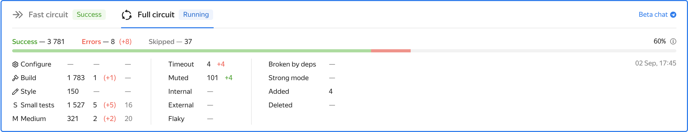

# Автосборка

Процесс автоматической проверки изменений в Аркадии, который мы называем автосборкой, выполняет одну из самых важных функций в экосистеме Аркадии —
контролирует корректность вносимых в репозиторий изменений, что является основным требованием при разработке в парадигме
[trunk-based development](https://cloud.google.com/architecture/devops/devops-tech-trunk-based-development).
Проекты, подключенные к Аркадийной автосборке, считаются tier0-проектами. Для этого требуется выполнение простого правила — проект должен быть достижим
по макросам [`RECURSE`](https://a.yandex-team.ru/arc/trunk/arcadia/build/docs/readme.md#170) от корневого файла [`ya.make`](https://a.yandex-team.ru/arc_vcs/ya.make)

## Пре-коммитные проверки { #precommit }
Корректность изменений проверяется путем выполнения сборки и запуска тестов в изменяемых компонентах и проектах, зависящих от нее.
Процесс автосборки задействует почти все сервисы отдела технологий разработки: после создания и регистрации pull request'а в Аркануме,
система Continuous Integration (CI) обрабатывает все правила в задетых данными изменениями проектах, которые описываются в файлах `a.yaml`,
и регистрирует проверку в соответствии с обнаруженными системой правилами.
Для выполнения проверки используется кластер распределенной сборки, который максимально распараллеливает процесс сборки изменений
и запуска необходимых тестов для минимизации времени ожидания результатов проверки.
Сборка производится в три основных этапа: стадия построения сборочного графа, сборки необходимых зависимостей, запуска тестов.
Эти этапы отражаются в Аркануме на специальном информере в Pull Request'е, который принято называть ["плашкой"](badge.md):

По мере выполнения сборки, результаты немедленно отправляются в систему Continuous Integration, где агрегируются
и используются Арканумом для отображения текущего состояния и прогресса выполнения проверки.
Если развернуть плашку, вы сможете увидеть более подробную разбивку по этапам сборки и классам запускаемых тестов.

При наличии ошибок сборки или тестирования, плашка отмечается красным цветом и вливание такого pull request'а блокируется Арканумом.
Таким образом и обеспечивается зеленый trunk в Аркадии и душевное спокойствие ваших коллег.

В первую очередь процесс автоматической сборки обеспечивает корректность на основной платформе, используемой в Яндексе — на Linux.
Но кроме этого каждая проверка запускается в кластере распределенной сборки в нескольких экземплярах для проверки в дополнительных конфигурациях:
memory— и address— санитайзеры, сборка под различные платформы типа Windows, MacOS, Android, IOS и другие.



Ошибки сборки в таких конфигурациях так же важны, как и ошибки сборки на основной платформе, не игнорируйте их, даже если ваш проект не использует эту платформу.



В случае, если проверка выявила проблемы в сборке или тестах, на плашке проверки будет отображено количество выявленных проблем по мере их обнаружения,
до завершения всей проверки. По клику на соответствующий счетчик можно перейти на подробный список поломок и узнать их причины.

Мы в отделе технологий разработки прикладываем максимум усилий для того, чтобы минимизировать время выполнения проверки,
но все-таки для проверки всей Аркадии она займет от единиц до нескольких десятков минут.
Для получения результатов проверки только по изменяемому проекту существует [быстрый контур проверок](fast-curcuit.md) —
он определяется автоматически на основе правил, описанных в `a.yaml`.
При обнаружении соответствующих правил будут запущены две проверки параллельно — полный контур для всей Аркадии и быстрый для измененного проекта или проектов.
Соответственно, на странице pull request'а вы увидите уже две плашки для каждого из контуров. При обнаружении проблем в быстром контуре
проверка полного контура будет автоматически отменена.

В процессах автосборки в Аркадии есть ряд важных отличий от большинства других систем автоматического тестирования, таких как TeamCity, Jenkins, TravisCI.
Одним из таких отличий является то, что базовая ревизия проверки не будет совпадать с ревизией вашей рабочей копии —
в момент регистрации pull request'а в Аркануме происходит своего рода rebase ваших изменений на последнюю ревизию trunk'а (HEAD).
Если ошибки в проверке вызваны изменениями, которые уже починили в более свежих ревизиях, вы можете перезапустить проверку,
перебазировав ее на HEAD кнопкой "Rebase and restart" в интерфейсе Арканума.

## Пессимизации проверок { #precommit_pessimization }
Если проверка затрагивает слишком большое количество проектов, например, изменение происходит в одном из общих компонентов Аркадии,
ее выполнение может быть отложено, чтобы исключить негативное влияние на скорость выполнения проверок других разработчиков Аркадии —
такие проверки называются пессимизированными.
Порог пессимизации подбирается нами таким образом, чтобы затрагивать менее одного промилле всех проверок.
Если проверка пессимизирована, на плашке будет выведено дополнительное сообщение об этом.
Пессимизированные проверки запускаются только в период с 9 часов вечера до 11 утра по Москве, в остальное время они будут ожидать исполнения в очереди — запаситесь терпением.

## Подключение к автосборке { #precommit_plug_in }

При добавлении нового проекта нужно обеспечить для него _достижимость по RECURSE-ам_ от корня Аркадии
(технически автосборка работает не совсем так, но данную фразу можно использовать в качестве приближённой модели).
Достижимость проекта обеспечивается:

* [правилами разработки](https://docs.yandex-team.ru/devtools/rules/reachability#dostizhimost%D1%8C)
* автоматической прекоммитной проверкой в составе [Arcadia Common Checks](https://clubs.at.yandex-team.ru/arcadia/26821) (предупреждение о недостижимости будет выведено прямо в Аркануме)
* регулярное посткоммитной проверкой, создающей тикеты в очереди DEVTOOLSUP в Трекере.



Мы рекомендуем использовать «плоские» RECURSE-ы для обеспечения достижимости: вместо одного `ya.make` c `RECURSE(my/project/dir)`
стоит завести несколько файлов так, чтобы пути в RECURSE не содержали слэшей.

Такой подход поможет при дальнейшем развитии и усложнении структуры проекта.





По умолчанию для каждого проекта, достижимого от корня Аркадии, проверяется собираемость под серверный Linux
(в терминах `ya make` это соответствует `--target-platform=default-linux-x86_64`).



Собираемость и тесты под остальные платформы нужно подключать явно.
Для этого проект нужно явно перечислить в нужном ya.make внутри директории [autocheck](https://arcanum.yandex-team.ru/arc_vcs/autocheck).
Так, для проверки автосборки под MacOS нужно вписать свой проект в [autocheck/darwin/ya.make](https://arcanum.yandex-team.ru/arc_vcs/autocheck/darwin/ya.make),
а для Windows — в [autocheck/windows/ya.make](https://arcanum.yandex-team.ru/arc_vcs/autocheck/windows/ya.make).

Изменения в конфигах применяются в том же PR-е: нужно чинить сборку проекта одновременно с добавлением проекта в автосборку.

Нами настроены десятки автосборочных платформ. Если у вас остались неотвеченные вопросы по автосборочным платформам — [смело задавайте вопрос](https://forms.yandex-team.ru/surveys/65090/).

## Вычислительные пулы { #compute_pools }
Каждая пре-коммитная проверка запускается в одном из вычислительных пулов, сконфигурированном на кластере распределенной сборки.
У вычислительных пулов есть параметры, определяющие объем гарантированных и максимально доступных ресурсов, а также список abc-сервисов и ролей в них,
имеющих право запуска проверок в конкретном пуле. При регистрации новой проверки среди всех вычислительных пулов, доступных автору проверки, выбирается наибольший.
Если автору проверки недоступен ни один из сконфигурированных вычислительных пулов, то выбирается пул по умолчанию `autocheck/precommits/public`.

В случае, когда изменения вносятся в общие компоненты (`/contrib`, `/util`, `/library` и т.д.), сборка выполняется в коммунальном пуле `autocheck/precommits/common_components`
Этот пул замечателен тем, что у него не очень большая гарантия на вычислительные ресурсы, но при этом очень большой верхний предел, что означает, что проверка в этом пуле может
занимать почти все ресурсы кластера распределенной сборки, если обеспечены гарантии в других автосборочных пулах.

## Пост-коммитные проверки { #postcommit }
После того, как вы закоммитите изменения в репозиторий, система CI инициирует процесс автосборки еще раз по правилам,
похожим на выполнения проверок в pull request'е, для исключения ситуации взаимного влияния изменений, которые могли быть внесены в репозиторий за то время,
пока выполнялась пре-коммитная проверка и проводился code review.
При обнаружении таких поломок вам на почту придет дополнительное уведомление от системы CI.



От вас, как от ответственного разработчика, ожидается, что вы почините все обнаруженные проблемы в новой итерации, добившись зеленого статуса всех автоматических проверок.


