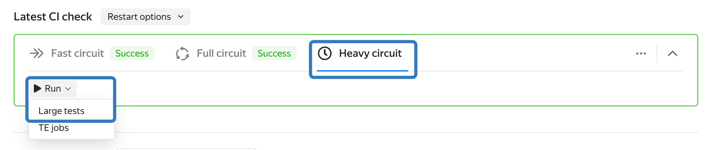
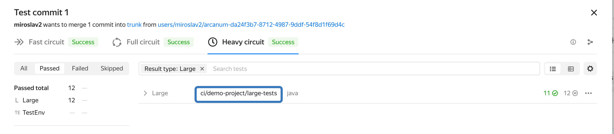
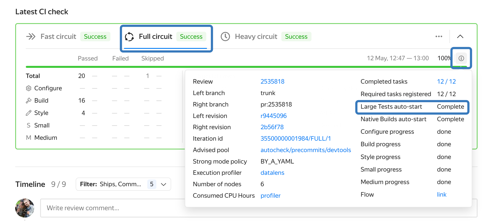

# Large тесты в автосборке

Large тестами считаются тесты, которые размечены в ya.make файле с помощью макроса `SIZE(LARGE)`.
Подробней о размерах тестов см. [документацию ya-make](https://docs.yandex-team.ru/ya-make/usage/ya_make/tests#size).
Каждый large тест отдельно выполняется в отдельной Sandbox задаче.

Так как large тесты обычно имеют широкий набор зависимостей или выполняются дольше 10 минут
и требуют больших вычислительных ресурсов, в PullRequest'ах они автоматически не запускаются..
Их можно запустить вручную, нажав `Run` на плашке и выбрав требуемые тесты,
которые были задеты текущими изменениями в PR.



Также, для large тестов может быть настроен Автозапуск в PR.

В посткоммитных проверках large тесты запускаются с некоторой частотой (раз в несколько часов),
и в случае изменения ранее известного статуса теста на другой
запускается бинарный поиск для установления коммита, которые привел к изменению статуса.

На large тесты не действует [политика перезапусков](test-retries.md)
(как с обычными тестами в случае их поломки).

## Привязка к проектам и квоты
Large тесты привязываются к проекту, который указан в ближайшем a.yaml-файле.
Тесты запускаются от имени робота, чей токен лежит в поле `ci.token` из секрета `ci/secret`
и с [Sandbox группой/квотой](https://docs.yandex-team.ru/sandbox/quota) из
поля `ci/runtime/sandbox-owner` в CI конфигурации.
В рамках этой квоты выполняются любые запуски:
автоматические и ручные в любых Pull Request'ах,
а также проверки на транковых ревизиях (посткоммиты).


Large тесты, для которых не нашлость ни одного a.yaml-файла,
привязываются к проекту [Autocheck](https://a.yandex-team.ru/projects/autocheck/autocheck?autoSelect=true),
запускаются в коммунальной квоте, однако в будущем эта квота будет [ликвидирована](https://st.yandex-team.ru/AUTOCHECK-102).


## Автозапуск large тестов {#autostart}

Для конкретной директории можно настроить автоматический запуск large тестов, указав соотвествующий раздел в a.yaml-файле.

Тесты будут запущены автоматически при выполнении двух условий:
1. Были изменения в директории конфига (или поддиректориях).
2. Large тесты задеты (задискаверены) по сборочному графу аналогично их ручному запуску по кнопке Run на плашке.




Настроить автоматический запуск large тестов за пределами директории с a.yaml-файлом
(выше по иерархии или же в другой корневой директории) нельзя.
Для автозапуска по зависимостям есть small и medium тесты. На запуск large тестов
(т.е. удлинение критического пути) владельцы директории должны явно согласиться.
[Подробнее про ограничение.](https://docs.yandex-team.ru/ci/discovery#pr-discovery-restrictions)




### Конфигурация

1. Убедиться, что в [Sandbox](https://sandbox.yandex-team.ru/admin/vault?name=ARC_TOKEN&limit=20) лежит токен **ARC_TOKEN** для Sandbox группы из п.3 выше.
2. Если тест запускается поверх YT (в ya.make указан `TAG(ya:yt)`),
нужно добавить YT-токен в Sandbox vault под именем `devtools-ya-test-yt-vanilla-execute`,
для группы, от которой будут запускаться тесты (sandbox-owner).
3. Создать в директории своего проекта a.yaml конфиг [по инструкции](https://docs.yandex-team.ru/ci/quick-start-guide).
В результате у нас должен получиться токен для робота, который должен лежать в `ci.token` секрета,
идентификатор которого указывается в разделе `secret`. Также необходимо описать раздел `runtime`.
Проверьте, что робот принадлежит sandbox группе, указанной в `runtime/sandbox-owner`: например, для робота "robot-martinext" [это можно узнать так](https://sandbox.yandex-team.ru/admin/groups?user=robot-martinext).
4. Если вы видите "ERROR: YT store token is missing. Cannot use YT store, your builds will be slow",
то для ускорения сборки можно добавить специальный токен `YT_STORE_TOKEN` в [Sandbox Vault](https://sandbox.yandex-team.ru/admin/vault).
Этот токен должен входить в вашу группу (из п.3). Сам токен можно получить [из YT](https://yt.yandex-team.ru/docs/gettingstarted.html#auth).
5. Опишите внутри раздела `autocheck` подраздел `large-autostart`. \
   Здесь поддерживается 2 синтаксиса: сокращенный и полный. Таргет для large теста это путь от корня аркадии, который отображается в CI интерфейсе
   теста 
    * Если необходимо просто запустить имеющиеся large тесты под всеми тулчейнами, то достаточно просто перечислить пути
      до этих large тестов. Пример:
    ```yaml
    service: ci
    title: Woodcutter
    ci:
      secret: sec-01dy7t26dyht1bj4w3yn94fsa
      runtime:
        sandbox-owner: CI
      autocheck:
        large-autostart:
          - some/large/test/target_1
          - some/large/test/target_2
          - some/large/test/multitargets/*

    ```
    * Если необходимо точно указывать тулчейны, под которыми нужен запуск, то придется воспользоваться полным
      синтаксисом, для каждого пути можно указать список тулчейнов для запуска (а можно опустить). Пример:
    ```yaml
    service: ci
    title: Woodcutter
    ci:
      secret: sec-01dy7t26dyht1bj4w3yn94fsa
      runtime:
        sandbox-owner: CI
      autocheck:
        large-autostart:
          - target: some/large/test/target_1
          - target: some/large/test/target_2
            toolchains: default-linux-x86_64-release
          - target: some/large/test/multitargets/*
            toolchains:
              - default-linux-x86_64-release-msan
              - default-linux-x86_64-release-asan
              - default-linux-x86_64-release-musl

    ```

[Список доступных тулчейнов](https://a.yandex-team.ru/arc_vcs/ci/core/src/main/resources/ci-core/schema/a-yaml-ci-schema.yaml?rev=r9098802#L769)

#### Важно:
1. Смешанный синтаксис не поддерживается
2. Если у вас один large тест или один тулчейн для каждого large теста, то поддерживается сокращение списка до одного
   объекта (строки). Пример:

```yaml
service: ci
title: Stream processor
ci:
    secret: sec-01e8agdtdcs61v6emr05h5q1ek
    runtime:
        sandbox-owner: CI
    autocheck:
        large-autostart:
            target: testenv/stream_processor/pt
            toolchains: default-linux-x86_64-release
```

3. Если у вас множетсво large тестов в определенной директории, допускается указание префикса или шаблона пути со `*`.
   Пример:

```yaml
service: ci
title: Woodcutter
ci:
    secret: sec-01dy7t26dyht1bj4w3yn94fsa
    runtime:
        sandbox-owner: CI
    autocheck:
        large-autostart:
            - some/large/test/*
            - devtools/ya/test/*/acceptance
```

### Использование
Автозапуск large тестов выполняет после завершения стадии Configure в Full circuit,
там же можно увидеть статус его работы.



## Детали запуска large тестов



Раздел высокоуровнево описывает пайплайн запуска large тестов и предназначен для разработчиков автосборки или страждущих деталей пользователей.
Вам не следует самостоятельно настраивать новые платформы или способы запуска large тестов, обратитесь для этого в [devtools support](https://forms.yandex-team.ru/surveys/devtools/).



### Как происходит запуск large теста

1. На каждый коммит`*` автосборка запускает конфигурацию всех платформ, которые к [ней подключенны](https://a.yandex-team.ru/arc/trunk/arcadia/autocheck/README.md).
   Графы сборки строятся для каждой платформы с патчем из PR и без, вычитаются друг из друга, восстанавливаются, и автосборка понимает, какие платформы задевает данный PR.

   Например, если в проекте вы меняете файл, который собирается под несколько платформ (Linux и Windows),
   но изменяемый файл подключён к сборке только под Windows, то автосборка после конфигурации всех платформ обнаружит,
   что это изменение задевает только платформу Windows, и запустит сборку и тестирование в полном контуре только для этой платформы.

   Детали про систему сборки и графы можно почитать в документации [ya make](/ya-make).

   `*` не в tier1 директории

2. Когда автосборка определилась с тем, какие платформы будет запускать,
   она располагает графами сборки, которые отправляет на Distbuild для их выполнения,
   и множеством skipped тестов, которые не попали в граф сборки, хотя и были задеты в PR.
   К категории skipped тестов относятся large тесты, так как Distbuild не предназначен для их запуска и не умеет запускать их,
   когда требуется специальное окружение или архитектура процессора.
   Все skipped тесты отправляются в CI в виде `DISCOVERED` данных о тесте.

3. CI получает `DISCOVERED` данные о тестах сразу после того, как платформа сконфигурирована,
   и пытается разобраться, следует ли запускать каждый large тест или нет в зависимости от:
    - пользовательских тегов в ya.make, например, `TAG(ya:not_autocheck)` явно запрещает.
      Подробности о тегах см. в [документации к тестам](/devtools/test/automated#system-tags)
    - [подключённых к запуску в large контуре платформ](https://a.yandex-team.ru/arc/trunk/arcadia/sandbox/projects/devtools/YaTestParent2/build/config.py?rev=r9134888#L14)

   Мы опускаем описание деталей по принятию CI решения о запуске large теста, так как эта часть активно меняется.
   Последнюю правду следует искать в [методе _is_launchable](https://a.yandex-team.ru/arc/trunk/arcadia/testenv/autocheck/ci_client/converter.py?rev=r9019806#L142)

4. Если `DISCOVERED` тест не запускается, CI отображает его как skipped с указанием в snippet-е причины, почему он не запускался..

5. Если `DISCOVERED` large тест допущен до запуска, то CI запускает таску [YaTestParent2](https://a.yandex-team.ru/arc/trunk/arcadia/sandbox/projects/devtools/YaTestParent2),
   которая в зависимости от платформы и пользовательских тегов
   [определяет, как следует запустить](https://a.yandex-team.ru/arc/trunk/arcadia/sandbox/projects/devtools/YaTestParent2/subtasks.py?rev=r9126207#L47-64)
   текущий large тест в виде дочерней таски.
   После того как дочерняя таска завершилась, YaTestParent2 скачивает результаты тестирования, насыщает их метриками и ссылками и отправляет в CI Storage.

6. CI после получения данных о прохождении large тестов отображает их в плашке PR.
