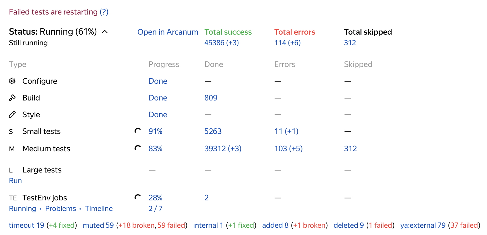

# Перезапуск тестов

**WIP**

Тесты по умолчанию запускаются только один раз, а для обнаружения flaky или failed тестов перезапускаются только
упавшие.

Перезапуск делается только в том случае, когда есть шанс перекрасить плашку в зелёный цвет. Например, если упала сборка,
перезапуска не будет. Также мы делаем перезапуск только если упавших тестовых сьют не больше 100. Новые добавленные
тесты перезапускаются только в случае, если во время запуска произошла внутренняя ошибка в автосборке, в остальных
случаях проверка считается ошибочной, чтобы не коммитить новые flaky тесты.

Если на прекоммитной проверке были перезапущены тесты, в левом верхнем углу появится надпись “Failed tests are
restarting”.

Ссылка на анонс: https://clubs.at.yandex-team.ru/arcadia/21427
