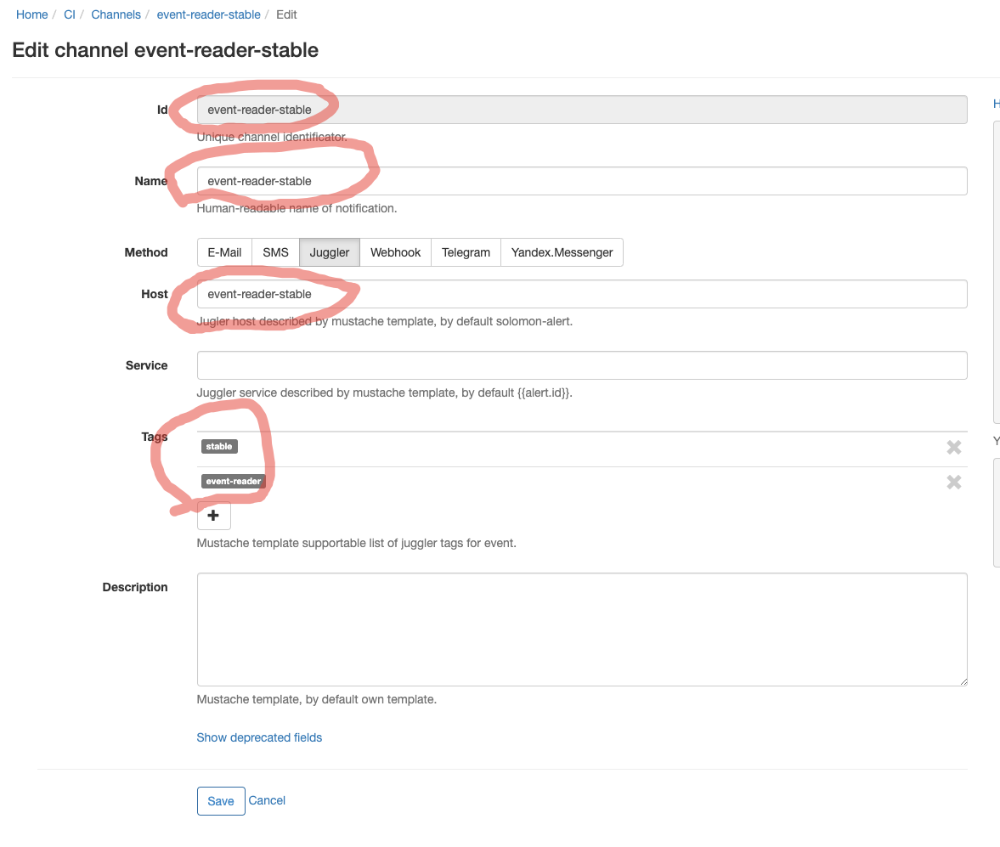
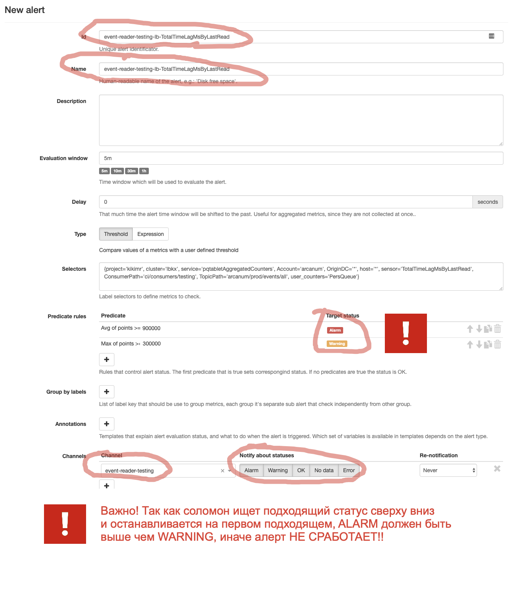

Дашборд
===
Все мониторинги собраны на [Juggler Dashboard](https://juggler.yandex-team.ru/dashboards/ci).

За CI часть следит дежурный по CI [CI Duty](https://abc.yandex-team.ru/services/testenv/duty/).
На Crit также настроены уведомления в [чат CI Alert](https://t.me/joinchat/A2HOP0tuUX5_fGBGM98Iog) который должен быть размьючен у дежурного.

Организация проверок
===

fullId - далее по тексту - комбинация названия сервиса и среды (testing/prestable/stable) через дефис. Например для сервиса event-reader и среды stable fullId=event-reader-testing

Juggler
====
Все проверки создаются в виде [агрегирующих проверок в Juggler](https://juggler.yandex-team.ru/aggregate_checks/?query=namespace%3Ddevtools.ci).

В качестве имени хоста (host) выступает комбинация названия сервиса и среды (testing/prestable/stable). Окружение и название сервиса дублируются в тегах.
В качестве имени сервиса выступает некоторая логическая группа харакретизующая набор алертов. Например в примере ниже в отдельную группу вынесены мониторинги на чтения из logbroker сервиса event-reader.

Пример создания агрегатов:
```yaml
namespace: devtools.ci # Namespace команды, константа
host: event-reader-stable # fullId={имя_сервиса}-{среда};
service: logbroker-read # Название логической группы событий
refresh_time: 90
ttl: 900
aggregator: logic_or
tags:
    - event-reader
    - stable
children: #Raw events из соломона.
    -
        host: event-reader-stable # fullId
        service: event-reader-stable-lb-TimeSinceLastReadMs #Id алерта в solomon
        type: HOST
    -
        host: event-reader-stable
        service: event-reader-stable-lb-TotalTimeLagMsByLastRead
        type: HOST
```

Мониторинги автоматически попадают на дашборд по namespace и тегу среды

Solomon
====
Все мониторинги для нового CI заводятся в [Solomon сервисе ci](https://solomon.yandex-team.ru/?project=ci).

Для комбинации сервис+среда заводится отдельный канал в Juggler'е. В полях Id, Name и Host указывается fullId (одинаковое значение на все три поля). В тегах указывается среда и имя сервиса (аналогично Juggler).
[Пример канала в Solomon.](https://solomon.yandex-team.ru/admin/projects/ci/channels/event-reader-stable)



На каждую среду заводится отельный алерт. Удобно создать один, а потом сделать Duplicate (не забывайте явно задать id). Для числовых значений рекомендуется указывать два погора (Warn и Crit)


В id и name алерта указывается {fullId}-{Название проверки}. Этот id надо указывать в поле children/service а Juggler'е.
Выбирается канал соответвующий нужному компоненту. В "Notify about statuses" надо отметить все доступные значения.
[Пример алерта](https://solomon.yandex-team.ru/admin/projects/ci/alerts/event-reader-stable-lb-TimeSinceLastReadMs)


