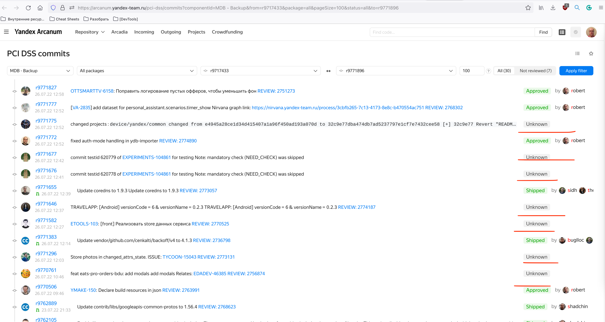

## PCI-DSS коммиты в статусе Unknown
Пример: https://arcanum.yandex-team.ru/pci-dss/commits?componentId=MDB%20-%20Backup&from=r9717433&package=all&pageSize=100&status=all&to=r9771896

Здесь можно посмотреть на статус коммитов: https://datalens.yandex-team.ru/t2ys7v07now2l-commits-status?state=0b33641e143

Рекомендованный способ починки - отправить коммиты на перезапуск: https://yql.yandex-team.ru/Operations/Yt_chZfFt_3RagRNML_zpPm6sProHprUrFNMEsLxFgQ=

P.S. Одна из наиболее вероятных причин проблем с коммитами: https://st.yandex-team.ru/DEVTOOLSSUPPORT-20818
