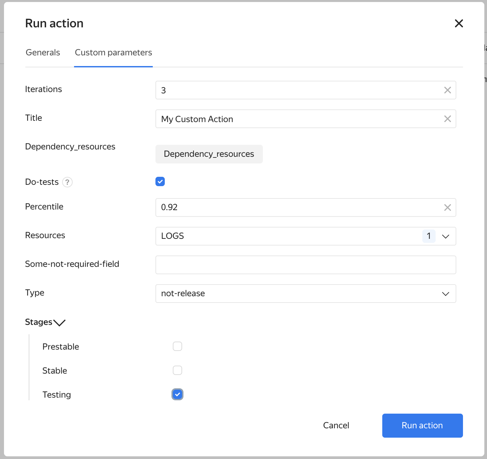

# Параметризованные flow (flow-vars)



Для понимания данного раздела необходимо понимать работу с [flow](flow.md) и [выражениями](expression.md).



В некоторых случаях необходимо запускать один и тот же flow, но с немного разными настройками.
Или использовать один и тот же параметр в нескольких задач, не копируя его и не пользуясь технологией YAML Anchor.

Параметризация flow позволяет написать буквально следующее, собрав одним выражением сразу 3 ресурса:
```yaml
  releases:
    my-releases:
      title: Релиз
      flow: my-flow
      flow-vars:
        type: Релиз
        build-list:
          - title: API
            package: ci/api/package.json
            resource-type: CI_API_APP
          - title: TMS
            package: ci/tms/package.json
            resource-type: CI_TMS_APP
          - title:  Event Reader
            package: ci/event-reader/package.json
            resource-type: CI_EVENT_READER_APP

  flows:
    my-flow:
      build:
        title: Сборка
        task: common/arcadia/ya_package
        multiply:
          by: ${flow-vars.build-list}
          title: Сборка ${by.title}
        input:
          packages: ${by.package}
          resource_type: ${by.resource-type}
          package_type: tarball
        manual:
          enabled: true
          prompt: Запустить сборку пакета ${by.package} для процесса "${flow-vars.type}"?
```

Параметры `flow-vars` можно указывать:
1) На уровне [релизов](release.md) - каждый из релизов будет запущен со своими собственными параметрами.
2) Для каждого [hotfix-flow релиза](release.md#hotfix) - каждый из хотфиксов будет запущен со своими параметрами.
3) В [action-ах](actions.md).

Параметры `flow-vars` можно использовать в блоках:
1) `title`, `description`, `version` в задаче
2) `input` в задаче
3) `prompt` в блоке `manual` в задаче
4) Выражении [`if`](expression-conditional.md)
5) Выражении [`multiply`](expression-multiply-by.md): `multiply/by` и `multiply/title`, как показано выше

Например,
```yaml
  releases:
    release-1:
      title: Релиз API
      flow: main-flow
      flow-vars:
        desc: Релиз API
        build-api: true
        test: true
    release-2:
      title: Релиз TMS
      flow: main-flow
      flow-vars:
        desc: Релиз TMS
        build-tms: true
        test: true

  actions:
    action-1:
      title: Сборка
      flow: main-flow
      flow-vars:
        desc: Сборка Review Request
        build-tms: true
        test: false
      triggers:
        - on: commit

  flows:
    main-flow:
      start:
        title: Сборка ${flow-vars.desc}
        description: Сборка в режиме ${flow-vars.desc}
        task: dummy

      build-api:
        title: API
        task: common/arcadia/ya_package
        needs: start
        if: ${not_null(flow-vars.build-api, `false`)}
        input:
          packages: ci/api/package.json
          resource_type: CI_API_APP
          package_type: tarball

      build-tms:
        title: TMS
        task: common/arcadia/ya_package
        needs: start
        if: ${not_null(flow-vars.build-tms, `false`)}
        input:
          packages: ci/tms/package.json
          resource_type: CI_TMS_APP
          package_type: tarball

      run-tests:
        title: Test
        task: common/arcadia/ya_make
        if: ${flow-vars.test}
        input:
          targets: ci/tms;ci/api
          definition_flags: -DJDK_VERSION=15
        needs:
            - build-api
            - build-tms
...
```

В этом примере в релизах "Релиз API":
1) Будет собран только пакет CI_API_APP
2) Будут выполнены все тесты

В релизах "Релиз TMS":
1) Будет собран только пакет CI_TMS_APP
2) Будут выполнены все тесты

В пост-коммите будут собраны пакеты CI_API_APP и CI_TMS_APP без тестов.

## Задание flow-vars в интерфейсе { #flow-vars-ui }

Если необходимо параметризировать каждый запуск экшена/релиза, то используйте секцию `flow-vars-ui`.
Для параметров описанных в этой секции будут отображаться поля в интерфейсе нового запуска.



Описание состоит из [json-схемы](https://json-schema.org/) в секции flow-vars-ui.schema:



Не допускается задавать значение параметра во flow-vars и вместе с тем получать его из интерфейса.
Для задания значений по умолчанию задавайте их свойстом `default:` в json-схеме.


