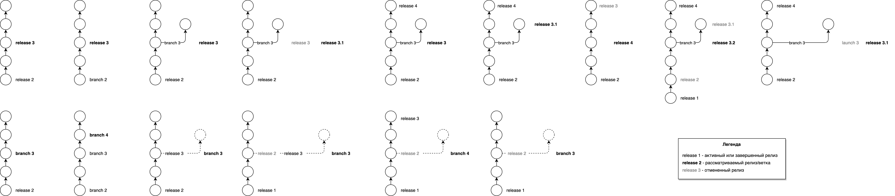

# Релизы



Видео по данной теме можно посмотреть [здесь](https://jing.yandex-team.ru/files/pochemuto/quick-start.mp4).



Ранее мы уже упоминали о том, что в CI имеется поддержка специальных типов flow, называемых **релизами**. Основные особенности таких flow:

* **Строгий порядок.** У каждого релиза есть порядковый номер. Релизы запускаются последовательно от более ранних изменений в репозитории до более свежих.
* **Несколько коммитов**. Релизы могут содержать любое количество коммитов. В релиз по умолчанию попадают все коммиты, созданные с момента предыдущего релиза.
* **Поддержка стадий**. Релизы могут быть разбиты на логические части, называемые **стадиями**. Примеры стадий: сборка исходного кода, тестирование, выкладка в тестовое окружение, выкладка в стабильное окружение. Каждая описанная стадия релиза может быть занята только одним активным релизом. Для того чтобы более новый релиз смог выполнить ту же стадию нужно отменить все предыдущие релизы.

## Важное отличие от других систем CI/CD { #differences }

В отличие от некоторых других систем CI/CD, наша система явно и безусловно отслеживает статусы релизов, гарантируя порядок и последовательность всех релизов в рамках одного релизного процесса (за некоторыми настраиваемыми исключениями).

Что это означает на практике:
* если релиз упал (висит в статусе `Failure`), то новый релиз не сможет его обогнать, т.е. не сможет выполниться, пока мы не решите, что вам нужно сделать с упавшим релизом.

Почему это так? Каждый релиз может находиться в 3 состояниях:
* релиз создан и готов для запуска (как правило, этот этап незаметен для пользователя),
* релиз выполняется,
* релиз завершен успешно или отменён.

Статус `Failure` относится именно к состоянию "релиз выполняется", занимая свою стадию - всё потому, что в этом статусе можно повторить упавшую задачу, продолжая выполнения релиза; или же отменить релиз целиком.

Если получится так, что ваш релиз состоит из одной стадии, то падение релиза не позволит запуститься новому релизу - об этом можно прочитать далее в описании стадий.

И, конечно, такое поведение можно изменить с помощью вытесняемых стадий, которые описаны далее.

## Описание стадий { #stage }

В данном разделе мы опишем релиз, у которого есть три стадии: `build`, `testing` и `stable`. На стадии `build` происходит сборка компонентов приложения, на стадии `testing` - выкладка в тестовое окружение, `stable` - выкладка в стабильное окружение:


Если стадия не занята ни одним релизом, то она называется свободной стадией. В примере выше все стадии заняты - `stable` занят релизом 11, `testing` занят релизом 12. Несмотря на то, что все задачи из стадии `testing` у релиза 11 завершены, стадия освободится только тогда, когда релиз перейдет на следующую. Например, релиз 12 ожидает стадию `stable`, а стадия `build` занята релизом 13.

Для того чтобы объявить релиз в **a.yaml** используется секция `releases`:

```yaml
service: my-service
title: Hello World Project
ci:
  # ... secret, runtime, triggers ...
  releases:
    my-release: # Объявление нового релиза
      title: My Release
      flow: my-release-flow # Какой flow использовать
      stages: # Объявление стадий релиза
          - id: build # Стадия build
            title: Build
          - id: testing
            title: Testing
          - id: stable
            title: Stable
          # deprecated формат стадий
          # build: # Стадия build
          #   title: Build
          # testing:
          #  title: Testing
          # stable:
          #   title: Stable
  flows:
    my-release-flow:
      title: Release App
      jobs:
          # Стадия build
          start-build:
              title: Start build
              task: dummy
              stage: build
          build-1:
            title: Build service 1
            task: common/arcadia/ya_package
            needs: start-build
          build-2:
              title: Build service 2
              task: common/arcadia/ya_package
              needs: start-build

          # Стадия testing
          start-testing:
              title: Deploy to testing
              task: dummy
              needs:
                  - build-1
                  - build-2
              stage: testing # Запуск этой задачи завершает стадию build и начинает стадию testing
          testing-1:
              title: Deploy testing 1
              task: common/arcadia/ya_package
              needs: start-testing
          testing-2:
              title: Deploy testing 2
              task: common/arcadia/ya_package
              needs: start-testing

          # Стадия stable
          start-stable:
              title: Deploy to stable
              task: dummy
              needs:
                  - build-1
                  - build-2
              stage: stable # Запуск этой задачи завершает стадию testing и начинает стадию stable
          stable-1:
              title: Deploy stable 1
              task: common/arcadia/ya_package
              needs: start-stable
          stable-2:
              title: Deploy stable 2
              task: common/arcadia/ya_package
              needs: start-stable
          finish:
              title: Finish release
              task: dummy
              needs:
                  - stable-1
                  - stable-2
          # После завершения всех задач последняя стадия stable автоматически освобождается
```



Если стадии явно не заданы, то весь релиз занимает только одну стадию, которая называется `single`. В этом случае можно не указывать поле `stage`.



### Вытесняемые стадии { #displacement }



* По-прежнему действует ограничение - на одной стадии релиза не может находиться более одной сборки.
* Автоматическое создание релизов не вытесняет сборки с первой стадии. Если вы хотите вытеснять и релизы, которые падают сразу же после запуска (либо же становятся ненужными на той же первой стадии), добавьте в начале отдельную стадию с `dummy` задачей.
* По умолчанию релизы вытесняются только если они ждут ручного подтверждения (`WAITING_FOR_MANUAL_TRIGGER`) или перехода на новую стадию (`WAITING_FOR_STAGE`). Если нужно вытеснять упавшие релизы, нужно явно добавить `FAILURE` в блок `on-status` вместе с двумя остальными статусами.




CI позволяет настроить специальное поведение для автоматического вытеснения стадий.
Например, это позволяет настраивать релизы, которые могут непрерывно раскатываться в тестинге, а в прод выходить по кнопке. Полный пример такой настройки можно посмотреть [в настройках CI](https://a.yandex-team.ru/arc/trunk/arcadia/ci/a.yaml), блок `ci-release`.

Настройка:
```yaml
service: my-service
title: Hello World Project
ci:
    # ... secret, runtime, triggers ...
  releases:
    my-release:
      title: My Release
      flow: my-release-flow
      auto: true # Включить автоматическое создание релизов
      stages:
        - id: build # Первая по порядку стадия процесса
          title: Build
        - id: testing
          title: Testing
          displace: true # Сборка в состоянии testing (которая не смогла перейти в состояние stable и находится либо в WAITING_FOR_MANUAL_TRIGGER, либо в WAITING_FOR_STAGE), может быть вытеснена следующим релизом
        - id: stable
          title: Stable # Требует ручного подтверждения
```

Как это работает:
1) Запускается **Релиз#1**
2) **Релиз#1** проходит стадии **build** (собирает бинарники), **testing** (выкладывает бинарники в тестинг), но не переходит в стадию **stable**, т.к. ручное подтверждение не выполнено
3) Запускается **Релиз#2**, проходит стадию **build**
4) **Релиз#2** пытается запуститься на стадии **testing** - и отменяет **Релиз#1** (после чего запускается на стадии **testing**)

Какие правила вытеснения будут применены: сборка вытесняет предыдущую сборку, если та находится на стадии, для которой настроена опция **displace**.

Например, если настроено

```yaml
# ... secret, runtime, triggers ...
releases:
  my-release:
    stages:
      - id: build
        title: Build
      - id: testing
        title: Testing
        displace: true
      - id: stable
        title: Stable
```
то Сборка#1 на стадии `testing` (ожидающая ручного подтверждения перехода на `stable`) будет вытеснена (отменена) Сборкой#2, которая готова перейти со стадии `build` на стадию `testing`.

При этом если Сборка#3 находится на стадии `build`, то вручную запущенная Сборка#4 ее не вытеснит - т.к. для `build` вытеснение запрещено.


Расширенные настройки:

```yaml
service: my-service
title: Hello World Project
ci:
    # ... secret, runtime, triggers ...
    releases:
        my-release:
...
stages:
  - id: build # Первая по порядку стадия процесса
    title: Build
  - id: testing
    title: Testing
    displace:
      on-status: # Условия вытеснения: сборка может быть вытеснена, если...
        - RUNNING                     # продолжают выполняться задачи (ПРИМЕНЯТЬ ОСТОРОЖНО)
        - RUNNING_WITH_ERRORS         # продолжают выполняться задачи с ошибками (ПРИМЕНЯТЬ ОСТОРОЖНО)
        - FAILURE                     # упала с ошибкой
        - WAITING_FOR_MANUAL_TRIGGER  # ожидает ручного подтверждения (по умолчанию)
        - WAITING_FOR_STAGE           # ожидает перехода на новую стадию (по умолчанию)
        - WAITING_FOR_SCHEDULE        # ожидает планировщика (ПРИМЕНЯТЬ ОСТОРОЖНО)
  - id: stable
    title: Stable # Требует ручного подтверждения
```

#### Автоматический запрет на вытеснение стадий при ручном запуске релиза { #displacement-manual }
Если у релиза есть опции для вытеснения и при этом для него настроен автоматический запуск, то в случае ручного запуска релиза для него автоматически будет установлена опция "Prevent displacement" ("Запрет вытеснения") в интерфейсе запуска релиза.

Опция "Prevent displacement" предотвращает вытеснение релиза другими релизами. Она полезна, если вы хотите гарантированно довести до конца нужный вам релиз (или просто задержать его на какой-то стадии) - все последующие релизы не смогу его вытеснить. Если опция установлена, то в интерфейсе будет видна надпись "Displacement disabled".
Опцию можно влючить и отключить на любом запущенном релизе (кнопки "Prevent displacement", "Allow displacement).

Если вы хотите изменить поведение (например, выставлять "Запрет вытеснения" по умолчанию для ручных запусков даже без настроек автоматического запуска), то это можно сделать опцией `displacement-on-manual-start`:

```yaml
service: my-service
title: Hello World Project
ci:
    # ... secret, runtime, triggers ...
  releases:
    my-release:
...
      stages:
        - id: testing
          displace: true
      displacement-on-manual-start: auto
```

`displacement-on-manual-start` используется только если для релиза есть настройки вытеснения и в случае ручного запуска релиза принимает значения:
1) `auto` (значение по умолчанию) - если у релиза есть опция автозапуска (`auto`), то опция "Prevent displacement" будет выбрана по умолчанию; если у релиза нет опции автозапуска, то "Prevent displacement" не будет выбрана.
2) `enabled` - опция "Prevent displacement" всегда выбрана по умолчаниюю
3) `disabled` - опция "Prevent displacement" всегда не выбрана по умолчаниюю


## Фильтры для включения коммитов в релиз { #filters }

Аналогично [триггерам](actions.md#filter) можно задавать фильтры, по которым коммиты будут попадать в релиз:

```yaml
service: my-service
title: Hello World Project
ci:
  # ... secret, runtime, triggers ...
  releases:
    my-release:
      title: My Release
      flow: my-release-flow
      auto: true
      filters: # Фильтры, по которым коммиты попадают в релиз
      - discovery: dir
        st-queues: [MARKET]
        sub-paths: ['**.java', 'ya.make']
      stages:
        # ...
```

Если не задано ничего, то в релиз попадают все коммиты с изменениями в каталоге с **a.yaml** файлом и всех его подкаталогах.

## Автоматическое создание релизов { #auto }

CI позволяет автоматически создавать релизы при появлении новых коммитов в ветке `trunk`. Для включения автоматического запуска релизов нужно добавить поле `auto: true`:

```yaml
service: my-service
title: Hello World Project
ci:
  # ... secret, runtime, triggers ...
  releases:
    my-release:
      title: My Release
      flow: my-release-flow
      auto: true # Включить автоматическое создание релизов
      stages:
        - id: build # Первая по порядку стадия процесса
          title: Build
        - id: testing
          title: Testing
        - id: stable
          title: Stable
```

Релиз создается автоматически:

* При появлении **нового коммита** (по указанным выше фильтрам), если свободна первая стадия (т.е. нет предыдущих запущенных релизов на этой стадии);
* При **освобождении первой стадии**, если она была занята другим релизом. В этом случае автоматически созданный релиз может содержать несколько коммитов, накопившихся за время, когда первая стадия была занята.

При автоматическом запуске CI убеждается, что релизный flow знает о всех предыдущих коммитах. Так как коммиты обрабатываются параллельно и с разной скоростью, то возможна ситуация, когда коммит `r2` случился позже `r1`, но `r2` обработан раньше. В этом случае в UI какое-то время будет виден только коммит `r2`. И как только появится `r1`, релиз будет автоматически запущен на ревизии `r2`.



Релизы не создаются автоматически на коммитах, содержащих файл **a.yaml** с ошибками.



Состояние автоматического создания релизов отображается в пользовательском интерфейсе:


Если автоматическое создание релизов было включено в **a.yaml**, то можно временно запретить создание релизов, переведя тот же самый переключатель в положение "выключено":


В таком положении релизы не создаются автоматически при любых значениях параметра `auto` в **a.yaml**.


### Условия автозапуска релизов { #auto-conditions }
Автозапуск релизов можно ограничить следующими условиями:
1. Минимальное количество коммитов: `min-commits`. Релиз будет автоматически запущен только в случае, если в него войдет
указанное количество коммитов.

2. Минимальное время с момента запуска предыдщего релиза: `since-last-release`. Релиз будет автоматически запущен только если с момента запуска предыдущего релиза прошло больше указанного количества времени.
   **Рассмотрим пример:** условие "не ранее чем через 2 часа", последний релиз запущен в 15:30 и коммитов для запуска нового релиза, нет. В 17:00 появился новый коммит, с момента запуска предыдущего релиза прошло 1:30, поэтому на этом коммите _в этот момент времени_ релиз не будет запущен. В 17:30 все условия запуска будут проверены снова, независимо от того, будут ли новые коммиты или нет и релиз будет запущен.

3. Временное окно или расписание: `schedule`. Можно указать дни недели и интервалы времени, в которые релизы могут запускаться автоматически. Аналогично условию на минимальное время с предыдущего релиза, если коммит получен в момент времени, не попадающий в окно, то автоматический запуск будет отложен до начала ближайшего окна времени.



## Релизные ветки { #branches }

Релизные ветки это специальные ветки в arc с префиксом ```releases/```. На них распространяются дополнительные гарантии, в отличие от пользовательских веток ```users/```, и они предназначены для стабилизации релизов. Подробнее про релизные ветки можно почитать в [документации](https://docs.yandex-team.ru/devtools/src/arc/branches#release-branches).

CI позволяет использовать релизные ветки для ваших релизов:
* Отводить ветки в интерфейсе CI
* Запускать релизы на коммитах из релизных веток



Релизные ветки должны отводиться только из интерфейса CI. Ветки, которые созданы в arc не через CI, например через консоль,
не появляются в интерфейсе.



Для того, чтобы начать пользоваться ветками:
1. Заведите префикс согласно [документации](https://docs.yandex-team.ru/devtools/src/arc/branches#nachalo-raboty)
2. [Дайте роботу](https://idm.yandex-team.ru/#rf-role=SrdvF8Y9#arc-vcs/create%28comment:%D0%A0%D0%B0%D0%B1%D0%BE%D1%82%D0%B0%20%D1%81%20%D0%B2%D0%B5%D1%82%D0%BA%D0%B0%D0%BC%D0%B8%20%D0%B2%20CI;fields:%28%29%29,rf-expanded=SrdvF8Y9,rf=1%29%29), которого вы [используете в своих CI процессах](https://docs.yandex-team.ru/ci/quick-start-guide#get-token), роль Create
3. Добавьте секцию `branches` в конфигурацию релиза:

```yaml
service: my-service
title: Hello World Project
ci:
  # ... secret, runtime, triggers ...
  releases:
    my-release:
      title: My Release
      flow: my-release-flow
      description: | # Многострочное описание релиза в формате Markdown
        Тестовый релиз.
        [Документация CI](https://docs.yandex-team.ru/ci/)
      branches:
        pattern: releases/my_project/my-release-${version}
```

`pattern` - шаблон имени ветки. Он должен содержать ваш префикс, `releases/my_project/` в примере, и подстановку `${version}`. О версиях будет рассказано [ниже](#versioning).

### Отведение релизной ветки { #create-branch }

В интерфейсе, напротив ревизии, появится кнопка отведения релизной ветки.


Не все коммиты доступны для отведения ветки. Отвести можно только от:
- коммита, который не входит ни в один активный или завершенный релиз
- коммита, на котором был запущен релиз


Также в меню слева появляется список веток, упорядоченных по последней активности


### Автоматическое отведение веток { #auto-create-branch }

Если вам почти всегда необходима дополнительная стабилизация релиза, которую вы производите в релизной ветке, вам может пригодиться автоматическое отведение ветки. Когда эта опция включена, запуск релиза в trunk сопровождается отведением ветки.

```yaml
# ...
        flow: my-release-flow
        branches:
          pattern: releases/my_project/my-release-${version}
          auto-create: true # автоматическое отведение ветки при запуске релиза в trunk
# ...
```

### Запрет на запуск релизов из trunk { #forbid-trunk-releases }

Если правила в вашей команде запрещают создавать релизы из транка, это можно запретить опцией `forbid-trunk-releases`:


```yaml
# ...
        flow: my-release-flow
        branches:
          pattern: releases/my_project/my-release-${version}
          forbid-trunk-releases: true # форсируем разработчика отводить ветку для релиза
# ...
```

### Автоматический запуск релизов в ветках { #branches-auto-release }

Для включения авторелизов в ветках нужно добавить `auto`, аналогично авторелизам в транке:


```yaml
# ...
        flow: my-release-flow
        branches:
          pattern: releases/my_project/my-release-${version}
          auto: true # Включить автоматическое создание релизов в ветках
# ...
```

### Независимые стадии в ветках { #independent-stages }

По умолчанию все релизы выстраиваются в очередь за стадиями. В этом случае релиз из ветки может дожидаться релиза
из транка или наоборот, что в подавляющем большинстве случаев желаемое поведение. В редких случаях релизы могут
безопасно кататься одновременно из разных веток. Для того чтобы включить независимость стадий в разрезе веток,
установите опцию `independent-stages: true` в вашем a.yaml:

```yaml
# ...
        flow: my-release-flow
        branches:
          pattern: releases/my_project/my-release-${version}
          independent-stages: true # включить независимость стадий между ветками
# ...
```



Включать эту опцию оправдано только в крайне редких случаях.



С этой опцией релизы в ветках, в том числе в транке, имеют независимые очереди стадий. И несколько релизов могут
занимать одну стадию, при условии, что они запущены в разных ветках.



Если релиз был запущен до отведения ветки, то релиз остается в очереди ветки trunk.
Однако последующие релизы в этой ветке будут иметь отличную очередь стадий.



Запуск релиза с отменой предыдущих релизов, при условии включенной опции `independent-stages`, приводит к отмене
только тех релизов, которые были запущены в той же ветке, что и запускаемый релиз.


### Источник конфигураций по умолчанию { #default-config-source }

При ручном запуске нового релиза по умолчанию предлагается последняя версия конфига из trunk-а, даже если релиз создается из релизного бранча.

Это поведение можно изменить - так что при запуске нового релиза будет предложен последний конфиг из текущего бранча:

```yaml
# ...
        flow: my-release-flow
        branches:
          pattern: releases/my_project/my-release-${version}
          default-config-source: branch # использовать конфиг из бранча; значение по умолчанию - trunk
# ...
```



Для любого релиза, созданного после 12 марта 2022, как минимум одна версия конфига в бранче будет всегда - это будет версия конфига, на котором был создан бранч.




## Версионирование { #versioning }

В шаблонах имени ветки используется подстановка `${version}`. Также версия доступна в [контексте флоу](flow.md#context). При создании ветки производится замена этой строки на текущую версию компонента, формат версии: `X[.Y]`, где `X` - мажорная часть версии, целое число, `Y` - опциональная минорная часть, целое число. Например `16.4`. Версиями обладают релизы и ветки. Версии генерируются автоматически при:
1. запуске релиза
2. отведении релизной ветки

Версии обладают следующими свойствами:
1. В релизном процессе, у которого не сконфигурированы релизные ветки, версия имеет формат целого числа
2. Не может быть два запуска с одинаковыми версиями
3. При каждом следующем запуске в trunk мажорная версия увеличивается
4. При запусках из релизных веток, увеличивается минорная часть. Мажорная часть соответствует версии ветки.
5. При отведении ветки от ревизии, на которой выполнен запуск, ветка будет использовать версию запуска. Например, если отвести ветку от релиза версии `15`, то увеличения версии не произойдет. И последующие запуски в этой релизной ветке будут иметь версии `15.1`, `15.2`.
6. Релиз, запущенный на коммите в релизной ветке, всегда имеет минорную часть.
7. Если ветка отводится от коммита, на котором не было запуска, генерируется следующая мажорная версия.



Запуски могут иметь пропуски в версиях в некоторых случаях. Например, если была отведена ветка, однако релиз в ней не был запущен.



На схеме ниже наглядно представлены перечисленные свойства:



#### Подгон версии { #versioning-match }
Для новых релизов версии начинаются с 1. В некоторых случаях может возникнуть необходимость подогнать версию, например, в случае переезда в CI существующих приложений. Чтобы этого добиться, добавьте опцию `start-version` в вашу конфигурацию релиза:



Рассмотрим пример. Если у вас уже есть приложение версии 17, и следующую вы собираетесь выкатить через CI, то добавьте в конфигурацию опцию `start-version: 18`.

Опция `start-version` проматывает счетчик версий вперед после запуска релиза. В примере выше после запуска релиза версии 18, строчку `start-version`, при желании, можно убрать из конфигурации.


## Hotfix для релизов { #hotfix }
Для каждого релиза можно настроить особые flow, выполняющие только часть стандартных операций. Например, в таких flow может быть только сборка и деплой, без интеграционных тестов, мониторингов, ручного подтверждения и т.д.

Такие flow рекомендуется использовать для hotfix-ов - т.е. максимально быстрой раскатки изменений.
Для каждого релиза такой список можно задать с помощью параметра `hotfix-flows`:
```yaml
service: my-service
title: Hello World Project
ci:
    # ... secret, runtime, triggers ...
    releases:
      my-release:
        title: My Release
        flow: my-release-flow
        hotfix-flows:
          - my-hotfix-flow1
          - my-hotfix-flow2
        ...
```



Flow, указанный в параметре `flow`, не должен использоваться в `hotfix-flows`.



Во время запуска релиза вам будет предложено выбрать один из вариантов загружаемых flow при наличии такой настройки. Все hotfix flow будут помечены в списке релизов специальным образом.

Для уменьшения количества копи-пасты в hotfix flow можно воспользоваться механизмом "YAML Aliases and Anchors":
```yaml
service: my-service
title: Hello World Project
ci:
    releases:
      my-release:
        title: My Release
        flow: my-release-flow
        hotfix-flows:
          - my-hotfix-flow
        ...

    flows:
      my-release-flow:
        build: &build
          title: Сборка

      ...
      my-hotfix-flow:
        build:
          <<: *build
```

Полный рабочий пример можно посмотреть в самом CI: [a.yaml, hotfix-ci](https://a.yandex-team.ru/arc/trunk/arcadia/ci/a.yaml)

Функциональность hotfix-ов рассчитана в первую очередь на работу с релизными бранчами.
А именно - вы можете создать новый релизный бранч, cherry-pick-нуть туда необходимые коммиты и выполнить на этом бранче hotfix flow.


Для hotfix-flows можно задавать произвольный набор [flow-vars](expression-flow-vars.md) - он полностью переопределит список flow-vars самого релиза:
```yaml
service: my-service
title: Hello World Project
ci:
    # ... secret, runtime, triggers ...
    releases:
      my-release:
        title: My Release
        flow: my-release-flow
        flow-vars:
          build: storage
          type: release
        hotfix-flows:
          - flow: my-hotfix-flow1
            flow-vars: # Полностью переопределит все переменные из релиза, т.е. переменная ${flow-vars.build} не будет существовать
              type: flow
        ...
```

Если `flow-vars` в hotfix-flows не задан, то будут использованы `flow-vars` из базового релиза.

## Статусы релизов { #statuses }
Статусы релизов, когда дальнейшее выполнение невозможно:
- `SUCCESS` - релиз успешно завершился
- `CANCELED` - релиз отменен

Статусы релизов, требующие действия пользователя:
- `FAILURE` - релиз не выполняется, одна или несколько задач завершились с ошибкой. Необходимо выполнить действие над упавшими задачами.
  Игнорировать ошибку – нажать Ignore error в окне детальной информации задачи, или перезапустить, или пропустить её,
  если у вас есть обходной путь по графу.
- `WAITING_FOR_MANUAL_TRIGGER` - граф дошел до задачи, требующей ручного подтверждения. Чтобы продолжить, нужно её запустить.
- `DELAYED` - запуск релиза отложен, необходимо делегировать токен. Это происходит, если есть изменения в файле a.yaml.
  После того как токен будет проделегирован, релиз продолжит выполнение.
- `IDLE` - флоу не выполняется, для продвижения нужен ручной запуск. Такое состояние возникает,
  если задача была остановлена пользователем. Для продвижения дальше её нужно перезапустить или пропустить.

Статусы, отражающие состояние работающего релиза:
- `STARTING` - происходит запуск релизного флоу.
- `RUNNING` - релизный флоу выполняет задачи в данные момент.
- `RUNNING_WITH_ERRORS` - релизный флоу выполняется, однако некоторые задачи завершились с ошибкой.
- `WAITING_FOR_STAGE` - ожидание освобождения стадии. Найти релиз, который удерживает стадию, можно из интерфейса
  релизного процесса, он расположен ниже текущего релиза. Или из интерфейса флоу, напротив заблокированной стадии ссылка
  на блокирующий релиз (blocking release).
- `WAITING_FOR_SCHEDULE` - выполнение не происходит, ожидание следующего момента для запуска задачи.
  Например, при настроенном автоматическом перезапуске задач. Ручных действий не требуется.
- `CANCELLING` - выполнение отмены релиза. Может занимать некоторое время, в этом состоянии релиз ожидает отмены уже работающих задач.
  Новые задачи не будут запущены.
- `WAITING_FOR_CLEANUP` - флоу завершен и ожидает запуска флоу очистки согласно заданной в конфигурации очистки опции `delay`.
- `CLEANING` - выполнение флоу очистки.


## "Rollback to" для релизов { #rollback }
Для каждого релиза можно настроить особые flow, выполняющие только действия по быстрому откату изменений на проде. Т.е. можно быстро "откатиться на" нужный вам релиз.
Такой откат является по сути **повторным применением ранее собранной версии в системе деплоя** (Deploy, Nanny, Samogon и т.д.).

Для каждого релиза такой список можно задать с помощью параметра `rollback-flows`:
```yaml
service: my-service
title: Hello World Project
ci:
    # ... secret, runtime, triggers ...
    releases:
      my-release:
        title: My Release
        flow: my-release-flow
        rollback-flows:
          - my-rollback-flow1
          - my-rollback-flow2
        stages:
          build:
            title: Сборка
          release:
            title: Релиз
            rollback: true
        ...
```



Необходимо отметить как минимум одну стадию с помощью флага `rollback: true` (об этом ниже).



С помощью опции `accept-flows` существует возможность явно указать список релизных flow (обычных или hotfix), на которых могут быть использованы конкретные rollback flows:
```yaml
service: my-service
title: Hello World Project
ci:
    # ... secret, runtime, triggers ...
    releases:
      my-release:
        title: My Release
        flow: my-release-flow
        hotfix-flows:
          - hotfix-1
          - hotfix-2
        rollback-flows:
          - flow: my-rollback-flow1
            accept-flows: hotfix-1
          - flow: my-rollback-flow2
            accept-flows:
              - my-release-flow
              - hotfix-2
        stages:
          build:
            title: Сборка
          release:
            title: Релиз
            rollback: true
        ...
```



Flow, указанный в параметре `flow` не должен использоваться в `rollback-flows`.




В интерфейсе появится кнопка "Rollback to", где вам будет предложено выбрать один из вариантов flow при наличии такой настройки. Сделать "Rollback to" можно только для того релиза, который выполнялся с уже настроенными rollback-ами.


### Минимальные настройки для включения "Rollback to" { #rollback-basic }

При использовании нескольких стадий необходимо пометить релизную стадию как `rollback: true` - т.е. задачи какой стадии необходимо повторить:
```yaml
service: my-service
title: Hello World Project
ci:
    # ... secret, runtime, triggers ...
    releases:
      my-release:
        title: My Release
        flow: my-release-flow
        stages:
           build:
              title: Сборка
           testing:
              title: Тестинг
           release:
              title: Релиз
              rollback: true
        ...
```

Только после включения и выполнения обычного релиза с этой настройкой у вас будет возможность выполнить откат на этот релиз.



Rollback, как правило, не имеет смысла, если у вас всего одна стадия - в таком случае проще сделать обычный hotfix flow.



Как это работает - все ресурсы всех задач из стадий, не отмеченных как `rollback: true`, попадают в контекст нового релиза. В запущенном rollback flow все задачи на стадиях, не отмеченных как `rollback: true`, будут пропущены - будут выполнены только задачи на отмеченной стадии (получив на вход ресурсы, созданные на предыдущих стадиях предыдущего запуска).

### Автоматический Rollback для релизов { #auto-rollback }

Существует возможность создавать автоматический flow отката - на основе базового релиза.

Все задачи из реестра, используемые в этом flow на стадиях `rollback: true`, должны иметь опцию `auto-rollback-mode: EXECUTE` или `auto-rollback-mode: SKIP`
```yaml
title: Лесоруб
description: Рубит лес на бревна
maintainers: ci
sources: /ci/tasklet/woodflow/woodcutter
auto-rollback-mode: EXECUTE

tasklet:
  implementation: WoodcutterPy

versions:
  stable: 1538235001
```
* Задачи, отмеченные как `EXECUTE`, будут выполнены в таком flow (и получат в контексте атрибут `flow_type: ROLLBACK`).
* Задачи, отмеченные как `SKIP`, будут пропущены в таком flow.
* Если в задаче не указан режим автоматического отката, то будет применена опция `DENY` - автоматический flow отката создать нельзя и при сохранении конфига вы увидите ошибку `task ... does not allow rollbacks`.

Так же как и в случае обычного flow отката, необходимо указать релизную стадию.



* Автоматический flow отката строится для каждого релизного flow (обычного и hotfix).
* Если по какой-то причине flow отката не может быть построен для релизного/hotfix flow и не указан ручной flow отката через `rollback-flows` - такая конфигурация является ошибочной. При включении механизма rollback-ов каждый релизный flow должен быть готов к применению этой опции.



## Мониторинг состояния релизов { #monitoring }

Состояния релизов выгружаются в
- [Juggler](event/juggler.md) - по ним можно настроить мониторинги на статусы релиза
- [Logbroker](event/event.md) - события о переходах релизов доступны в очереди сообщений
- [Yandex Monitoring](event/monitoring.md) - количественные метрики релизов в различных состояниях
