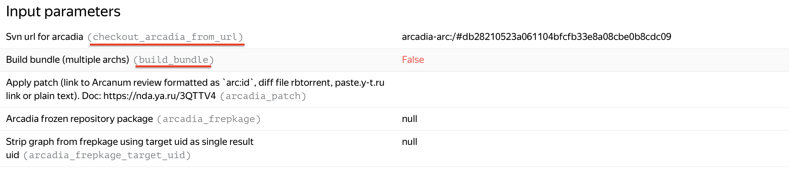

ya_package_2, ya_make
===================

Выполняют `ya package` [doc][ya-package-doc] и `ya make` [doc][ya-make-doc] соответственно.
Запускаются в sandbox задачами [YA_PACKAGE_2][ya-package-filter] [YA_MAKE_2][ya-make-filter].

*Задача ya_package является deprecated. Её использование не рекомендуется.*

Использование
-------------
В конфигурации добавить все необходимые параметры. Ключи параметров можно взять из любого существующего
запуска задачи в скобках

YT cache
--------
В задачах по умолчанию включено использование [YT кэша][yt-cache-doc]. Однако для его использования вашему роботу необходимо получить до него доступ.
Сделать это можно [в IDM по ссылке][yt-cache-idm].

[ya-package-doc]: https://docs.yandex-team.ru/devtools/package/
[ya-package-filter]: https://sandbox.yandex-team.ru/tasks?children=false&hidden=false&type=YA_PACKAGE_2
[ya-make-doc]: https://wiki.yandex-team.ru/yatool/make/
[ya-make-filter]: https://sandbox.yandex-team.ru/tasks?children=false&hidden=false&type=YA_MAKE_2
[sandbox-owner-example]: https://a.yandex-team.ru/arc_vcs/ci/a.yaml?rev=b5fecd6d538905f088091e765da24449f32667cc#L6
[get-token]: https://oauth.yandex-team.ru/authorize?response_type=token&client_id=5c2eb9ec7cc74dcd960f400ff32b7b38
[yt-cache-doc]: https://docs.yandex-team.ru/ya-make/usage/ya_make/yt_store
[yt-cache-idm]: https://nda.ya.ru/t/FYsZuuiX3zscLZ
