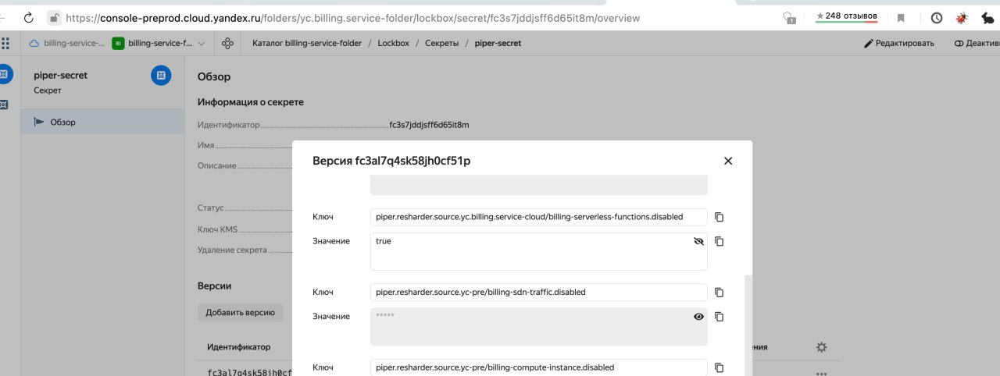

# Обслуживание системы
Информация, собранная в этом разделе, пригодится для траблшутинга и мониторинга системы.

## Графики
Графики и панели для мониторинга собраны на дашбордах в Grafana, в папке [yc-billing](https://grafana.yandex-team.ru/dashboards/f/aJ2_oTPMk/yc-billing).
Для пайпера основной дашборд — это [Piper overview](https://grafana.yandex-team.ru/d/Hxztspp7z/piper-overview).
На нём дашборде отображается основная информация о состоянии пайпера, его хостах, а также о сообщениях, которые через него проходят и топиках, из которых производится чтение данных.
Рекомендуется добавить дашборд в Favorites, чтобы быстрее его находить при необходимости.

Есть также дашборд [Piper connections](https://grafana.yandex-team.ru/d/Bb4d_ppnk/piper-connections), он пригодится для отладки внешнего общения пайпера.

## Виртуальные машины

Список виртуальных машин можно увидеть в консоли облака: [Prod](https://console.cloud.yandex.ru/folders/yc.billing.service-folder/compute/instances) | [Preprod](https://console-preprod.cloud.yandex.ru/folders/yc.billing.service-folder/compute/instances).

К пайперу относятся те машины, которые содержат в имени "piper", можно воспользоваться фильтру по имени.

### Как зайти на машину {#svmlogin}
Зайти на машину можно через утилиту pssh, используя имя машины.

pssh — утилита для доступа к машинам в контуре облака с использованием yubikey. Настройка — [здесь](https://wiki.yandex-team.ru/cloud/yubikey/).

```shell
~ % pssh piper-vla1.billing.cloud-preprod.yandex.net
Welcome to Ubuntu 20.04.3 LTS (GNU/Linux 5.4.0-96-generic x86_64)

 * Documentation:  https://help.ubuntu.com
 * Management:     https://landscape.canonical.com
 * Support:        https://ubuntu.com/advantage

The programs included with the Ubuntu system are free software;
the exact distribution terms for each program are described in the
individual files in /usr/share/doc/*/copyright.

Ubuntu comes with ABSOLUTELY NO WARRANTY, to the extent permitted by
applicable law.

Last login: Wed Feb 16 08:19:21 2022 from 2a02:6b8:bf00:110b:526b:4bff:fedb:6de9
groups: cannot find name for group ID 167713
asukhodko@piper-vla1:~$
```

### Сервис kubelet
На машинах развёрнут сервис kubelet, который создаёт контейнеры пода пайпера и следит за ними.
pod-файл находится в `/etc/kubelet.d/piper.pod`.

## Логи
Логи отправляются в систему Cloud Logging ([Prod](https://console.cloud.yandex.ru/folders/yc.billing.service-folder/logging/group/e23i7m272uaculnuil1h/logs?size=500) | [Preprod](https://console-preprod.cloud.yandex.ru/folders/yc.billing.service-folder/logging/group/af3n9num4ddavd5bt49m/logs?size=500)), но доступны также и на машинах, в папке `/var/log/fluent/`.

## Logbroker
[Prod](https://logbroker.cloud.yandex.ru/yc-logbroker/accounts/yc.billing.service-cloud?page=browser&type=account) | [Preprod](https://logbroker-preprod.cloud.yandex.ru/yc-logbroker-preprod/accounts/yc.billing.service-cloud?page=browser&type=account)

[Prod-ya](https://lb.yandex-team.ru/logbroker/accounts/yc/?page=browser&type=account) | [Preprod-ya](https://lb.yandex-team.ru/logbroker/accounts/yc/preprod?page=browser&type=directory)

## Jaeger
[Prod](https://jaeger.private-api.ycp.cloud.yandex.net/search?service=yc-billing-piper&start=1645798056395000&end=1645808856395000&limit=100&lookback=2d&maxDuration&minDuration) | [Preprod](https://jaeger.private-api.ycp.cloud-preprod.yandex.net/search?service=yc-billing-piper&start=1645798086409000&end=1645808886410000&limit=100&lookback=2d&maxDuration&minDuration)

## YDB
[Prod](https://monitoring.ydb.yandex-team.ru/tenant/schema?schema=/global/billing/hardware/default/billing/meta/billing_accounts&name=/global/billing&schemaTab=Query&backend=https://ydb.bastion.cloud.yandex-team.ru/billing-dn-vla1.svc.cloud.yandex.net:8765) | [Preprod](https://monitoring.ydb.yandex-team.ru/tenant/schema?schema=%2Fpre-prod_global%2Fbilling&name=%2Fpre-prod_global%2Fbilling&schemaTab=Query&backend=https%3A%2F%2Fydb.bastion.cloud.yandex-team.ru%2Fu-vm-cc80rv1pkc4iue4vl2df-ru-central1-b-lvka-ajyv.cc80rv1pkc4iue4vl2df.ydb.mdb.cloud-preprod.yandex.net%3A8765&clusterName=cloud_preprod_kikimr_global)

## Lockbox
[Prod](https://console.cloud.yandex.ru/folders/yc.billing.service-folder/lockbox/secret/e6q4dv1j8upp5pm4dk3v/overview) | [Preprod](https://console-preprod.cloud.yandex.ru/folders/yc.billing.service-folder/lockbox/secret/fc3s7jddjsff6d65it8m/overview)

### Временное отключение чтения определённого топика решардером
Для отключения чтения топика нужно добавить ключ `piper.resharder.source.<SOURCE_NAME>.disabled` со значением `true`.

Где `<SOURCE_NAME>` — название источника в конфигах.

Пример ([configuration/configs/preprod/piper/resharder.yaml](https://a.yandex-team.ru/arc_vcs/cloud/billing/go/piper/configuration/configs/preprod/piper/resharder.yaml)):
```yaml
resharder:
  source:
    yc.billing.service-cloud/billing-serverless-functions:
      handler: general
      logbroker:
        installation: yc_preprod
        topic: /yc.billing.service-cloud/billing-serverless-functions
```
Пример:




В Lockbox можно сохранить не более 32 ключей, так что, если изменения не временные или их много, то следует внести их в [конфиги](configs.md).



См. также [{#T}](configs.md#local-config) — другой вариант внесения временных изменений в конфиги.



После сохранения новой версии секретов или конфигов нужно зайти на машины и перезапустить piper.
[{#T}](maintenance.md#svmlogin) | [Утилита piper-control](piper-control.md)



## Остановка piper
Если нужно остановить piper, то проще всего переименовать pod-файл на машинах, и kubectl автоматически остановит все контейнеры пода.
```shell
~# docker ps
CONTAINER ID   IMAGE                  COMMAND                  CREATED        STATUS        PORTS     NAMES
7c8749a1b727   6ea70c2b08b2           "/usr/bin/piper -c /…"   44 hours ago   Up 44 hours             k8s_piper_yc-billing-piper-pod-piper-vla1_default_735f9e44b9b753f7ca5bf014b9286e4d_1
c340d7e27104   0d9bf8b9fc51           "/entrypoint.sh tvm"     44 hours ago   Up 44 hours             k8s_tvmtool_yc-billing-piper-pod-piper-vla1_default_735f9e44b9b753f7ca5bf014b9286e4d_1
101bdca84d71   0d9bf8b9fc51           "/entrypoint.sh unif…"   44 hours ago   Up 44 hours             k8s_unified-agent_yc-billing-piper-pod-piper-vla1_default_735f9e44b9b753f7ca5bf014b9286e4d_1
6a10a5c1d0f6   0d9bf8b9fc51           "/entrypoint.sh jaeg…"   44 hours ago   Up 44 hours             k8s_jaeger-agent_yc-billing-piper-pod-piper-vla1_default_735f9e44b9b753f7ca5bf014b9286e4d_1
155c27d6d2f6   k8s.gcr.io/pause:3.1   "/pause"                 44 hours ago   Up 44 hours             k8s_POD_yc-billing-piper-pod-piper-vla1_default_735f9e44b9b753f7ca5bf014b9286e4d_1
~# mv /etc/kubelet.d/piper.pod /etc/kubelet.d/.piper.pod
~# docker ps
CONTAINER ID   IMAGE     COMMAND   CREATED   STATUS    PORTS     NAMES
~#
```

Чтобы запустить piper снова, достаточно переименовать файл обратно:
```shell
~# mv /etc/kubelet.d/.piper.pod /etc/kubelet.d/piper.pod
```

### Остановить/запустить piper на всех машинах
PROD:
```shell
~# pssh run -p10 -a 'sudo mv /etc/kubelet.d/piper.pod /etc/kubelet.d/.piper.pod' D@piper-all.billing.cloud.yandex.net
```
```shell
~# pssh run -p10 -a 'sudo mv /etc/kubelet.d/.piper.pod /etc/kubelet.d/piper.pod' D@piper-all.billing.cloud.yandex.net
```

PREPROD:
```shell
~# pssh run -p10 -a 'sudo mv /etc/kubelet.d/piper.pod /etc/kubelet.d/.piper.pod' D@piper-all.billing.cloud-preprod.yandex.net
```
```shell
~# pssh run -p10 -a 'sudo mv /etc/kubelet.d/.piper.pod /etc/kubelet.d/piper.pod' D@piper-all.billing.cloud-preprod.yandex.net
```

## Перезапустить piper на всех машинах
PROD:
```shell
~# pssh run -p10 -a 'sudo piper-control restart' D@piper-all.billing.cloud.yandex.net
```

PREPROD:
```shell
~# pssh run -p10 -a 'sudo piper-control restart' D@piper-all.billing.cloud-preprod.yandex.net
```
