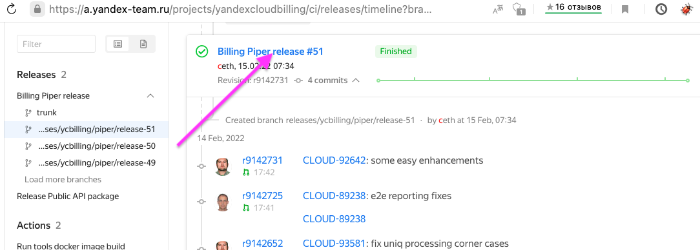
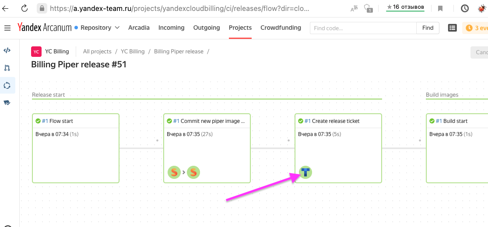

# Как собрать релиз

- Убеждаемся, что все утилиты из [этого списка](https://a.yandex-team.ru/arc_vcs/cloud/billing/go/deploy/terraform/Readme.md) установлены на ноуте.
- Заходим в Аркануме в раздел [CI](https://a.yandex-team.ru/projects/yandexcloudbilling/ci) проекта `YC Billing`.
- Выбираем `Billing Piper release` и ветку **trunk**.
- Напротив последнего коммита раскрываем три точки и жмем `Run release`. Значения оставляем по умолчанию.
- Появится ветка релиза и запустится flow релиза. Выбрав релизную ветку можно раскрыть flow и наблюдать за процессом.
  
- Ждем, пока создастся релизный тикет. Ссылка на него появится в соответствующем блоке релизного flow.
  
- В релизном тикете будут появляться команды и остальные указания. Выполняем их.

## FAQ

### Падает выполнение шага копирования образа (hopper)

В окружениях сейчас установлен лимит на количество образов и регулярно деплой его исчерпывает.
Чтобы убрать старые образы в окружении можно воспользоваться командой (**не забыть выбрать нужный профиль и сделать во всех окружениях**)

```(bash)
> yc --folder-id yc.billing.service-folder --format json compute image list| jq -c 'map(select(.family=="biling-piper"))|sort_by(.created_at)|reverse|.[5:][]|.name'|tee|xargs -L 1 yc --folder-id yc.billing.service-folder compute image delete --async --name
```

После этого надо удалить в окружениях образ текущего релиза и перезапустить шаг копирования.
```(bash)
> yc --folder-id yc.billing.service-folder compute image delete --name <имя образа см. в релизном тикете>
```
