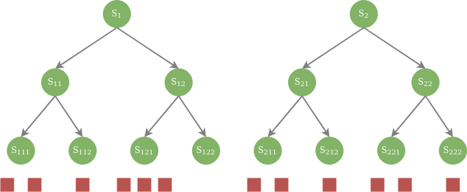
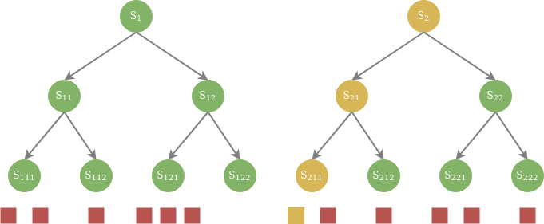
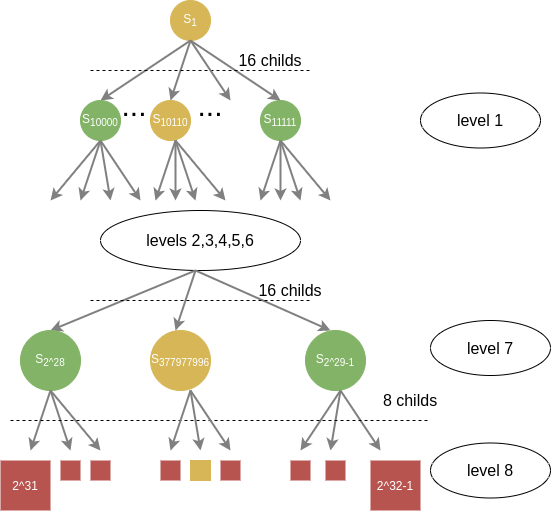

Алгоритм используется во всех read-through-кэшах с refresh-ahead.

Предположения, исходя из которых выбрана схема кэширования:
1. Данных достаточно много, они не умещаются целиком в памяти одной машины.
2. Горячих данных достаточно мало, чтобы кэш ограниченного размера работал эффективно.
3. Пока данные не стали горячими, задержки при обращению к кэшу допустимы.
4. Читающих операций на несколько порядков больше, чем пишущих.
5. Данные в кэшах распредены по инстансам неравномерно: одним и тем же инстансам требуются по большей части разные
   данные, при этом есть и пересечения.

Основная идея взята из структуры данных дерево отрезков (segment tree). Все пространство ключей исходных данных делится
на достаточно большое количество сегментов, так чтобы данные более-менее равномерно распределялись по ним. Сегменты
выстраиваются в иерархию, образуя дерево.



Таким образом, любому значению ключа соответствует N различных сегментов, где N — высота дерева.



С каждым узлом в дереве связано некоторое числовое значение. При изменении или удалении исходных данных значение каждого
связаного с их ключами сегмента заменяется случайным числом.

Для инкрементального обновления кэша используется следующий алгоритм:
1. Для каждого ключа в кэше вычисляются сегменты, в которых он находятся.
1. Для сегментов на первом уровне дерева читаются их значения в хранилище данных.
1. Если значения сегмента отличается от сохраненного локально, то алгоритм повторяется с предыдущего пункта для
   сегментов следующего уровня, а измененное значение сегмента сохраняется локально.
1. Если после применения алгоритма остались сегменты последнего уровня, локальные значения в которых отличаются от
   полученных из хранилища, все ключи в этом сегменте инвалидируются.

Для определения сегментов ключа используется следующая схема:
1. Вычисляется [fnv1a](https://en.wikipedia.org/wiki/Fowler%E2%80%93Noll%E2%80%93Vo_hash_function#FNV-1a_hash) от ключа.
1. В полученном 32-битном значении `x` старший бит устанавливается в 1.
1. На первом уровне дерева номер сегмента равен `x >>> 27`, таким образом всего 16 возможных различных значений (от
   `10000` до `11111`).
1. На втором и последующих уровнях (всего еще 7 уровней) номер сегмента равен `x >>> (32 - n * 4 - 1)`
1. Для уровней со второго по шестой по 16 возможных различных значений под каждым сегментом предыдущего уровня.
Для седьмого уровня по 8 различных значений под каждым сегментом.

### Пример

Ключ равен "b1grsqqv524655dmk823"
```
fnv1a("b1grsqqv524655dmk823") | (1 << 31) = 3023823974

level | segment decimal | segment binary
------------------------------------------------------------
1     |  22             | (10110)
2     |  360            | (101101000)
3     |  5767           | (1011010000111)
4     |  92279          | (10110100001110111)
5     |  1476476        | (101101000011101111100)
6     |  23623624       | (1011010000111011111001000)
7     |  377977996      | (10110100001110111110010001100)
8     |  3023823974     | (10110100001110111110010001100110)

```




В коде алгоритм немного отличается из-за оптимизаций. Например, если в сегменте какого-то уровня (непоследнего) остается
слишком мало ключей, алгоритм может прерваться и инвалидировать все ключи в этом сегменте, несмотря на то что возможно
не все данные по этим ключам поменялись в хранилище. Также загрузка значений сегментов может идти не точно по уровням,
чтобы снизить общее количество запросов, посылаемых в хранилище (например, в первой итерации может быть загружено 16
сегментов первого уровня и еще какое-то количество сегментов второго уровня за один запрос в хранилище).


