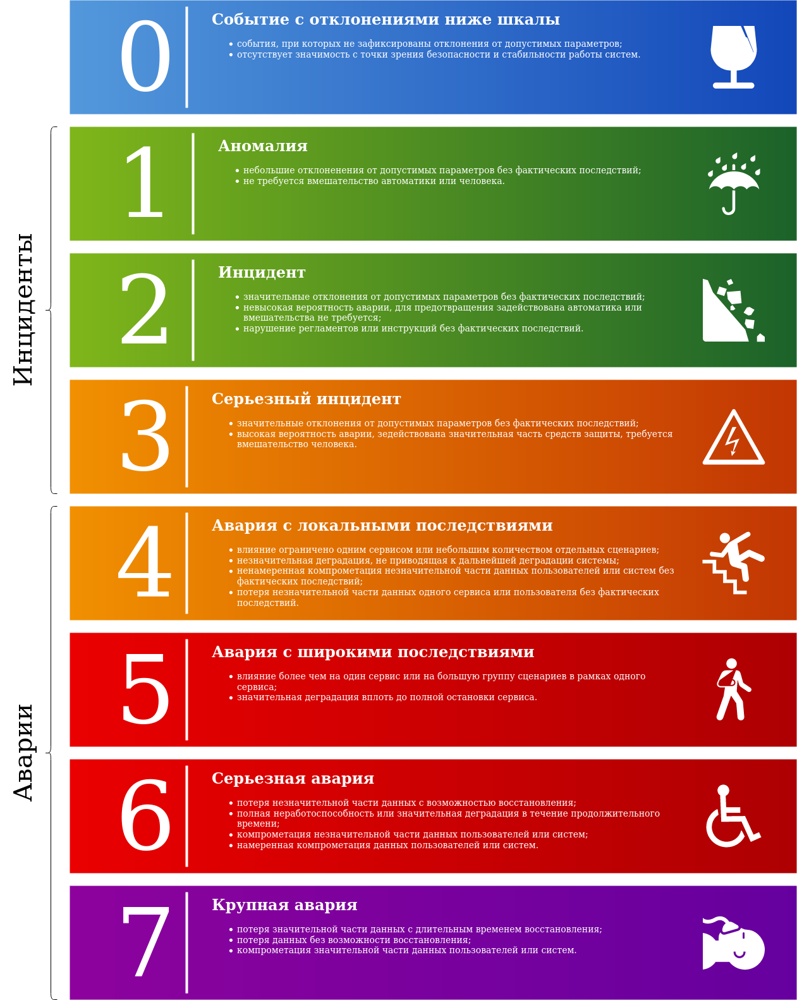



Изложенные здесь методы классификации, расследования и анализа чрезвычайных ситуаций во многом повторяют
аналогичные процессы в гражданской атомной промышленности (INES) и гражданской авиации (ADREP).



## Шкала чрезвычайных ситуаций

В целях единообразия оценки чрезвычайных ситуаций принята следующая шкала.

Под пользователями понимаются как внешние пользователи сервисов, получающие к ним доступ через UI и API,
так и другие сервисы, использующие в своей работе сервис, где случилась чрезвычайная ситуация.

### Критерии классификации чрезвычайных ситуаций

Все ситуации оцениваются по каждой из соответствующих категорий, а именно:

1. выход параметров работы систем за допустимые при эксплуатации значения;
   1. [У0] отклонений нет: отклонения не зафиксированы мониторингами или не замечены на графиках;
   2. [У1] небольшие отклонения: незвонящие мониторинги, некритичные отклонения на графиках, замеченные человеком;
   3. [У2] значительные отклонения: звонящие мониторинги, существенные отклонения на графиках, стремительное ухудшение
      ситуации;
   4. [У4] незначительная деградация: единичные internal в сервисах, массовые unavailable для одного клиента,
      ухудшение latency до 50% от порога мониторинга за не менее чем минутный интервал;
   5. [У5] значительная деградация: массовые internal или unavailable в сервисах, ухудшение latency более 50% от порога
      мониторинга за не менее чем минутный интервал;
   6. [У6] значительная деградация в течение длительного времени: время деградации превышает 1 час;
2. вмешательство автоматики или человека для восстановления допустимых параметров работы;
   1. [У0] вмешательство не требуется: система вернулась к допустимым параметрам сама или отклонения не были зафиксированы;
   2. [У2] сработала автоматическая защита: автоматическая защита (например, рестарт сервиса или вывод ноды из под балансера)
      вернула систему к допустимым при эксплуатации параметрам;
   3. [У3] требуется вмешательство человека: система вернулась к допустимым параметрам только благодаря действиям человека;
3. наличие нарушений регламентов и инструкций при эксплуатации систем;
   1. [У0] нарушений нет;
   2. [У2] нарушение зафиксировано, но не привело к аварии: например, вследствие нарушения регламента выкладки сработал
      мониторинг;
   3. [У4] нарушение привело к аварии: например, вследствие нарушения регламента выкладки сервис не был доступен;
4. влияние на пользователей и соседние сервисы;
   1. [У0] влияния нет;
   2. [У4] влияние на один сервис или небольшое количество сценариев в разных сервисах: влияние ограничено одним
      сервисом (помимо того, в котором произошла авария), ошибки проявляются в небольшом количестве отдельных сценариев,
      не являющихся базовой функциональностью сервиса;
   3. [У5] влияние более чем на один сервис или на значительное количество сценариев в одном сервисе: влияние
      распространяется на 2 и более сервисов (помимо того, в котором произошла авария), затронутая фукнциональность не
      позволяет нормально использовать базовые сценарии в сервисе;
5. компрометация данных;
   1. [У0] данные не скомпрометированы;
   2. [У4] ненамеренная компрометация незначительной части данных без фактических последствий: данные одного или
      нескольких пользователей или сервисов потенциально могли быть доступны посторонним лицам, однако возможностью
      никто не воспользовался;
   3. [У6] намеренная компрометация данных, компрометация незначительной части данных: любой факт намеренной
      компрометации данных, данные одного или нескольких пользователей или сервисов стали доступны посторонним лицам;
   4. [У7] компрометация значительной части данных: значительная часть данных пользователей или сервисов стала доступна
      посторонним лицам;
6. потеря данных;
   1. [У0] потерь нет;
   2. [У4] потеря небольшой части данных без фактических последствий: данные одного или нескольких пользователей или
      сервисов были утеряны и восстановлены, факт потери данных не был замечен пользователями сервиса и не повлиял на их
      работу с сервисом;
   3. [У6] потеря небольшой части данных с возможностью восстановления: данные одного или нескольких пользователей или
      сервисов были утеряны и восстановлены, факт потери данных был замечен пользователями сервиса;
   4. [У7] потеря данных без возможности восстановления.

Присваемая ситуации оценка — максимальный уровень, определяемый в результате рассмотрения каждой из этих
категорий.

### Примеры классификации чрезвычайных ситуаций

1. [У7] [LSR-434](https://st.yandex-team.ru/LSR-434/) удалены диски и виртуальные машины пользователей, восстановление
   невозможно.
2. [У6] [CLOUDINC-646](https://st.yandex-team.ru/CLOUDINC-646/) из базы ошибочно удален пользователь, было проведено
   восстановление.
3. [У6] [CLOUDINC-1086](https://st.yandex-team.ru/CLOUDINC-1086/) значительная деградация Access Service в течение
   часа;
4. [У5] [CLOUDINC-1609](https://st.yandex-team.ru/CLOUDINC-1609/) массовые ошибки во многих сервисах в момент перегрузки
   базы данных IAM.
5. [У4] [CLOUDINC-1391](https://st.yandex-team.ru/CLOUDINC-1391/) возможность выписывания токена произвольного
   сервисного пользователя, фактов использования не обнаружено.
6. [У3] [CLOUDINC-1020](https://st.yandex-team.ru/CLOUDINC-1020/) рост нагрузки на базу данных IAM, стремительное
   ухудшение ситуации после выкатки релиза с неоптимальным запросом.
7. [У2] [CLOUD-78225](https://st.yandex-team.ru/CLOUD-78225/) задача мониторинга потребления в заблокированных и
   удаленных ресурсах иногда падает по таймауту.
8. [У1] [CLOUD-73906](https://st.yandex-team.ru/CLOUD-73906/) аномально высокие значения на графике
   guava_cache_miss_total в AccessService при определенных параметрах отображения, появляющиеся из-за несовершенства
   системы мониторинга.
9. [У0] [CLOUD-74563](https://st.yandex-team.ru/CLOUD-74563/) периодические RST со стороны TokenService при запросах с
   бэкендов YMQ.

### Соответствие уровней шкалы чрезвычайных ситуаций и уровней важности инцидентов Облака

В общем случае нет четкого соответствия уровня чрезвычайной ситуации и
[уровня важности инцидента в Облаке](https://wiki.yandex-team.ru/cloud/regulations/cloudinc/), т.к. их
оценка опирается на различные критерии: основной вклад в уровень важности инцидента в Облаке вносит наличие или
отсутствие влияния на внешних пользователей (в частности через анализ их обращений в поддержку), оценка уровня
чрезвычайной ситуации позволяет отделить аварии от инцидентов и оценить вероятность ухудшения ситуации, перерастания
инцидента в аварию.

Все аварии уровней с 5 по 7 в обязательном порядке заводятся как инциденты в Облаке. Решение о заведении инцидента в
остальных случаех принимается дежурным, основываясь на вероятности перерастания ситуации в аварию и необходимости
информирования инцидент-менеджера о ситуации.

## Действия дежурного при возникновении чрезвычайной ситуации

1. Идентифицировать проблему и найти в данном руководстве соответствующую инструкцию. Если такая инструкция есть,
   действовать согласно ей.
2. Если инструкции нет, использовать [стандартную инструкцию по обеспечению жизнеспособности сервиса в критических ситациях](https://).
   В случае аварии или подозрении на высокую вероятность аварии незамедлительно связаться с ответственным за сервис и
   сообщить о критической ситуации.
3. Завести тикет, используя соответствующий [шаблон](https://st.yandex-team.ru/createTicket?queue=CLOUD&_form=73795/).
4. Информировать команду сервиса о чрезвычайной ситуации, отправив ссылку на тикет во внутренний чат сервиса.
5. Периодически отписывать в тикет о своих действиях и развитии ситуации.
6. В случае необходимости изменять уровень и текущий статус чрезвычайной ситуации и информировать об этом команду
   сервиса.

## Заполнение отчета о чрезвычайной ситуации

Цели заведения тикета о чрезвычайной ситуации:
- оперативное информирование заинтересованных лиц о любых аномалиях, имеющихся на данный момент в сервисе;
- оценка возможности влияния ситуации на проблемы в других сервисах;
- оценка вероятности ухудшения ситуации и перерастания ситуации в аварию;
- анализ причин и формирование рекомендаций по предотвращению ситуаций по аналогичным причинам в будущем;
- статистика о слабых местах в сервисах (на какие компоненты надо выделять больше ресурсов при планировании задач
  стабильности);
- статистика о работе дежурного (сколько времени уходит на тушение пожаров).

Отчет заполняется primary-дежурным. В случае отсутствия primary-дежурного во время возникновения чрезвычайной ситуации
отчет может заполняться лицом, замещающим его обязанности (backup-дежурным или иным сотрудником). Если окончательный
отчет не может быть сформирован primary-дежурным за время его дежурства, продолжение формирование отчета производится им
же после завершения дежурства, за исключением случая его отсутствия, например, по причине болезни или отпуска. В этом
случае окончательный отчет заполняется следующим по очереди primary-дежурным.

Для заведения тикета используется [шаблон](https://st.yandex-team.ru/createTicket?queue=CLOUD&_form=73795/).

Возможны следующие статусы тикета:
- _In Progress_ — инцидент или авария происходит в данный момент;
- _Blocked_ — инцидент не может быть устранен без решения тикетов из action items;
- _Discussing_ — все негативные эффекты инцидента или аварии полностью устранены;
- _Released_ — завершено расследование, проведен анализ фактов, сделаны выводы, определены причины, сформированы
  рекомендации;
- _Closed_ — проведен разбор, отчет согласован.

Тикет состоит из четырех частей:
- расследование — факты, условия и обстоятельства, заполняется в описании тикета;
- анализ — рассмотрение фактов, приведенных выше, и анализ этих фактов —  обычно проводится в комментариях к тикету;
- выводы и причины — включает подтвержденные выводы — заполняется в описании тикета;
- рекомендации — информация о уже принятых мерах и предложения для рекомендаций по обеспечению стабильности сервиса —
  заполняется в описании тикета.

### Расследование

Описательная часть отчета, содержит подробный перечень всех фактов и обстоятельств, зафиксированных в ходе чрезвычайной
ситуации. Подтверждением фактов могут являться графики, мониторинги, фрагменты логов, трейсы запросов, фрагменты
переписки из рабочих чатов и личных сообщений, расшифровки звонков и т.п. Последовательность событий следует излагать в
хронологическом порядке начиная с того периода, который включает важные события, предшествующие чрезвычайной ситации.



До решения [SOLOMON-6094](https://st.yandex-team.ru/SOLOMON-6094/) в отчет необходимо прикладывать **скриншоты**, а не
ссылки на графики.



Важной информацией фактической части отчета являются действия или попытки действий, которые были совершены участниками.

### Анализ

Во время анализа фактов рассматриваются и анализируются значения соответствующих фактов и обстоятельств, которые были
изложены в предыдущем разделе, чтобы установить причины чрезвычайной ситуации. В случае необходимости дежурный привлекает
разработчиков соотвествующих сервисов и других участников ситуации, призывая их в комментарии к тикету для анализа.

В случае обнаружения в ходе анализа дополнительных фактов, данные факты должны быть включены в описательную часть
отчета.

При выдвижении гипотез каждая из них (в том числе оказавшаяся ложной) должна быть указана в аналитической части отчета.
Любая неподтвержденная версия должна сопровождаться фактами, четко указывающих на ее недоказанность (при этом она может
присутствовать в отчете как предположение, что необходимо явно указать).

При выявлении противоречивых доказательств об этом необходимо явно указать в отчете.

### Выводы и причины

Выводы подготавливаются на основе проведенного анализа. Выводы являются важными для понимания произошедшего, но при этом
они не всегда объясняют причины или указывают недостатки. Выводы, как и факты, должны перечислять в логической
последовательности и, как правило, в хронологическом порядке.

Выводы должны подтверждаться фактами и результатами анализа. Выводы не должны содержать новой информации о фактах.

Причиной является действие, упущение, условия или обстоятельства, исключив или устраненив которые, можно было
предотвратить чрезвычайную ситуацию или уменьшить ее последствия. Сопоставление причин должно объяснять, почему произошла
чрезвычайная ситуация. Перечень причин должен включать как непосредственные, так и глубокие системные причины.

Причины не должны включать новую информацию, не изложенную в предыдущих разделах отчета.

### Рекомендации

Рекомендации являются действиями для предотвращения других чрезвычайных ситуаций по аналогичным причинам или уменьшения
последствий таких ситуаций. Рекомендация должна быть конкретной и выраженной в виде тикета, имеющего конкретный
адресат.

Рекомендация излагает проблему, связанную со стабильностью сервиса или процесса, и мотивирует принятие необходимых мер.
При заведении тикета с рекомендацией необходимо обращать большее внимание на саму проблему, а не на предложенное
решение, чтобы предоставить адресату свободу действий для определения путей достижения рекомендации.

### Разбор чрезвычайных ситуаций и согласование отчета

Разбор проходит два раза в неделю:
- [Еженедельная встреча в среду](https://calendar.yandex-team.ru/event/46477920?applyToFuture=0&event_date=2021-06-30T14%3A00%3A00&layerId=36012&show_date=2021-06-28/)
- [Встреча в пятницу по нечетным неделям](https://calendar.yandex-team.ru/event/56963382?applyToFuture=0&event_date=2021-06-25T11%3A00%3A00&layerId=36012&show_date=2021-06-21/)
- [Встреча в пятницу по четным неделям](https://calendar.yandex-team.ru/event/56908870?applyToFuture=0&event_date=2021-07-02T10%3A00%3A00&layerId=36012&show_date=2021-06-28)

Во время разбора автор рассказывает что происходило во время чрезвычайной ситуации, проводит анализ произошедших фактов
и представляет выводы и причины произошедшего. В случае согласия всех участников с выводами и причинами отчет считается
согласованным. Если присутствующие не согласны с выводами, отчет отправляется на доработку.

### Контроль реализации мероприятий по итогам рекомендаций

Проходит два раза в месяц:
- [Встреча в среду по нечетным неделям](https://calendar.yandex-team.ru/event/46477920?applyToFuture=0&event_date=2021-06-30T14%3A00%3A00&layerId=36012&show_date=2021-06-28/)
