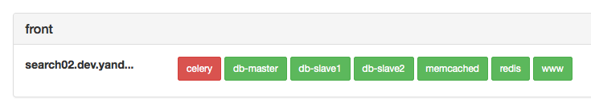

## ЧТО ЭТО
Библиотека для Django, которая умеет:
* делать различные проверки,
* сохранять их состояние,
* выводить отчёт для пользователя в консоль, в ответ ручки `/ping` или на веб-страницу статуса.

```shell
$ manage.py alivestate
www at search02.dev.yandex-team.ru [front] -> OK stamp{2015-02-12 18:45:03+00:00, {u'status': 302}}

redis at search02.dev.yandex-team.ru [front] -> OK stamp{2015-02-12 18:45:03+00:00, None}

celery at search02.dev.yandex-team.ru [front] -> FAIL stamp{2015-02-12 18:23:41+00:00, {u'app': u'default'}}
```

```shell
$ manage.py alivestate --monrun
2;FAIL
```



## ТЕРМИНЫ
  * *Проверка* (check) – какая-то атомарная логика, которая что-то проверяет. Реализуется в *чекерах* (checkers).
  * *Стемпер* (stamper) – сущность, реализующая хранение состояния проверок (*стемпов* (stamp)).
  * *Группа* (group) – объединение проверок. Например: `front`, `back`, `gen`.

## НАСТРОЙКА

1. Добавить приложение `django_alive` в `INSTALLED_APPS`.
2. Добавить в `settings.py` импорт дефолтных настроек: `from django_alive.settings import *`.
3. Описать стемперы, проверки и группы в `ALIVE_CONF`.
4. *Опционально*: добавить `'django_alive.middleware.AliveMiddleware'` в настройку `MIDDLEWARE_CLASSES` **самым первым** элементом списка, чтобы работали ручки `/ping` и `/_alivestate`.
5. *Опционально*: сгенерировать cron- и monrun-конифги для запуска и мониторинга проверок.

### `ALIVE_CONF`

Самый простой `ALIVE_CONF` состоит из хотя бы одного стемпера, одной проверки и одной группы. Например:

```python
ALIVE_CONF = {
    'stampers': {
        'db': {
            'class': 'django_alive.stampers.db.DBStamper'
        }
    },
    'checks': {
        'db-master': {
            'class': 'django_alive.checks.db.DBChecker',
            'stamper': 'db',
            'alias': 'default',
        },
    },
    'groups': {
        'front': [
            'db-master',
        ],
    },
}
```

Структура конфига очень похожа на настройку `LOGGING`. Вначале описываем стемпер, потом указываем его у проверки и добавляем её в группу. Для стемперов и проверок обязателен параметр `class`, который указывает на import path до соответствующего класса стемпера или чекера. Для проверки надо обязательно указать название стемпера в параметре `stamper`. Все остальные параметры зависят от конкретного стемпера или чекера.

### Стемперы
Доступные стемперы:

* `django.alive.stampers.db.DBStamper` – сохраняет стемпы проверок в базу через ORM.

* `django_alive.stampers.mongodb.MongoDBStamper` – сохраняет стемпы проверок в MongoDB.

 Параметры:
 * `client_path` – import path до `pymongo` клиента или callable объекта, который этот клиент вернет.

* `django_alive.stampers.redis.RedisStamper` – сохраняет стемпы проверок в Redis.

 Параметры:
 * `client_path` – import path до `redis-py` клиента или callable объекта, который этот клиент вернет.

### Чекеры
Доступные чекеры:

* `django_alive.checkers.celery.CeleryWorkerChecker` – проверяет, что Celery выполняет задачи. Ставит задачу в очередь, которая пишет стемп.

 Опциональные параметры:
 * `app` – import path до Celery приложения,
 * `priority` – приоритет задачи, от 0 до 9.
 * `queue` – очередь в которую ставится таска для проверки. Можно использовать плейсхолдер `%h`, в который подставится текущий хост.

 Для работы этого чекера воркер должен слушать специальную очередь для каждого хоста. Этот функционал включается настройкой [`CELERY_WORKER_DIRECT`](http://celery.readthedocs.org/en/latest/configuration.html#celery-worker-direct)

 **Важно:** если вы используете кастомное имя воркера, который слушает дефолтные очереди, то необходимо передать параметр `queue` и не забыть суффикс `.qd` на конце. Например: `'queue': 'default@%h.dq'`.

* `django_alive.checkers.celery.CeleryBeatChecker` – проверяет что Celery beat ставит задачи в очередь.

 Опциональные параметры:
 * `app` – import path до Celery app,
 * `priority` – приоритет задачи. От 0 до 9. Чем больше тем выше приоритет.

 Помимо требований, идентичных тебованиям к `CeleryWorkerChecker`, необходима настройка расписания Celery beat. Пример для задания расписания в `celeryconf.py`:

```python
CELERY_CONF = {
    ...
    'checks': {
        ...
        'celery-beat': {
            'class': 'django_alive.checkers.celery.CeleryBeatChecker',
            'stamper': 'db',
        },
        ...
    },
    'groups': {
        'front': [
            ...
            'celery-beat',
            ...
        ],
    },
}


from django_alive.utils import current_host


CELERYBEAT_SCHEDULE['alive-check'] = {
    'task': 'django_alive.tasks.check',
    'schedule': 60,
    'kwargs': {'name': 'celery-beat', 'group': 'front'},
    'options': {
        'priority': 9,
        'queue': 'celery@%s.dq' % current_host
    },
}
```

 Если вы используете django-celery и задаёте расписание через БД, то для каждого хоста, на котором требуется проверять Celery beat, нужно добавить по одной задаче с явным указанием очереди хоста, аналогично фаловому конфигу.

* `django_alive.checkers.db.DBChecker` – проверяет состояние базы. Зависит от `django_replicated`.

 Опциональные параметры:
 * `alias` – алиас конкретной базы из настройки `DATABASES`.

* `django_alive.checkers.generic.GenericChecker` – сам ничего не делает, а только пишет стемп. Можно использовать, как косвенную проверку стемпера, что он может что-то записать.

* `django_alive.checkers.http.HTTPChecker` – http чекер, который дергает указанную ручку и смотрит на ответ. Зависит от `requests`.

 Параметры:
 * `url` – урл запроса.

 Опциональные параметры:
 * `method` – HTTP метод, которым дергается url.
 * `headers` – кастомные заголовки.
 * `ok_statuses` – статусы, которые считаются успешными.
 * `timeout`– таймаут на соединение и чтение.

* `django_alive.checkers.memcached.MemcachedChecker` – проверяет доступность Memcached. Пытается записать значение и получить его обратно.

 Параметры:
 * `client_path` – import path до `python-memcached` клиента или callable объекта, который этот клиент вернет.

* `django_alive.checkers.mongodb.MongodbChecker` – проверяет доступность MongoDB. Пытается записать значение и получить его обратно.

 Параметры:
 * `client_path` – import path до `pymongo` клиента или callable объекта, который этот клиент вернет.

* `django_alive.checkers.redis.RedisChecker` – проверяет доступность Redis. Пытается записать значение и получить его обратно.

 Параметры:
 * `client_path` – import path до `redis-py` клиента или callable объекта, который этот клиент вернет.

## Использование
Чтобы запустить проверки, нужно позвать management команду `alivecheck`:
```shell
$ manage.py alivecheck -g front
```

после этого можно проверить состояние проверок через вызов `alivestate`:
```shell
$ manage.py alivestate -g front
```

Запускать проверки и проверять их состояние можно как для групп, так и для отдельных проверок.

Запускать проверки нужно с некой периодичностью, которая меньше или равна `ALIVE_CHECK_TIMEOUT`. Рекомендуется это делать через cron каждую минуту.

Так же, при подключении `AliveMiddleware` будет доступна ручка `/ping` и статус-страница по адресу `/_alivestate`.

## Работа с состоянием
Из проверок формируется объект `state`, возвращаемый функцией `django_alive.state.get_state`. Структура состояния: `проверка -> группа -> хост -> флаг`. Плюс специальная группа `self`, в которой сохранены состояние проверки (`StateCheck`) для текущего хоста.

Состояния проверки – это результат вычисления её успешности. По умолчанию проверка считается успешной, если в её стемпере есть стемп, записанный не позднее, чем `ALIVE_CHECK_TIMEOUT` секунд назад.

`StateCheck` приводится к `bool` в зависимости от успешности проверки.

Пример:

```python
>>> state = get_state()
>>> state
{'db-master': {'front': {'host1': CheckState<OK stamp{2015-02-12 19:47:02+00:00, None}>}, 'self': [CheckState<OK stamp{2015-02-12 19:47:02+00:00, None}>]}}
```
**Важно:** в группе `self` вегда список состояний. Поскольку одна проверка может быть в нескольких группах, а на одной машине могут быть запущены проверки для нескольких групп, то у каждого хоста может быть несколько состояний для одной проверки.

Для тех случаев, когда требуется выразить всё состояние проверок одним значением, используется специальная reduce функция. Эта функция получает объект `state` и должна вернуть обобщённый `bool` флаг. Дефолтная reduce функция возвращает `True`, если во всех `self` группах случились успешные проверки.

Пример reduce функции:
```python
def custom_reduce(state):
    """Мастер доступен на всех фронтах
    """
    return all(state['db-master']['front'].itervalues())
```

Reduce функция используется для вычисления результата работы ручки `/ping` (настройка `ALIVE_MIDDLEWARE_REDUCE`) и команды `alivestate --monrun` (параметр `-r`).

## Генерация конфигов
Для удобства можно сгенерировать командой `alivegen` конфиги. Они нужны для запуска проверок через cron и вычисления их состояния через monrun.
